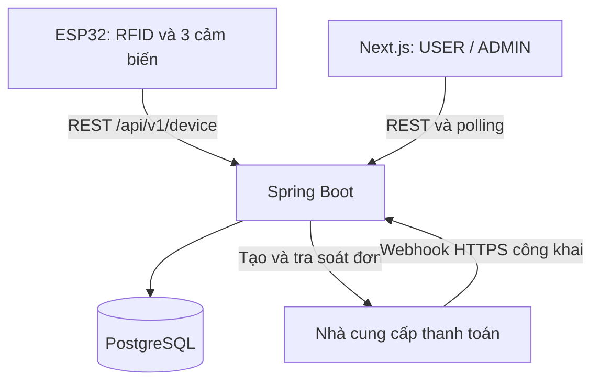

# SRS — Hệ thống quản lý bãi đỗ xe thông minh

Phiên bản: 2.3 — 23/09/2026  
Stack bắt buộc: Spring Boot · Next.js · PostgreSQL · ESP32  
Mục đích: nguồn yêu cầu để nhóm 3 người và Codex triển khai, kiểm thử một mô hình bãi đỗ xe; hỗ trợ học Spring Boot theo từng chức năng.

## 0. Cách sử dụng tài liệu và mức độ quyết định

- **CONFIRMED**: người dùng đã xác nhận, không tự thay đổi.
- **DEFAULT**: mặc định thiết kế được đề xuất trong SRS này để có thể triển khai ngay; chưa phải quyết định do người dùng xác nhận. Nếu thay đổi, cập nhật SRS, API và test cùng lúc.
- **TBD**: phụ thuộc thông tin chưa có. Chỉ chặn phần liên quan; không tự đoán phần cứng, thông tin ngân hàng hay khóa bí mật.
- “Phải” là yêu cầu bắt buộc trong phạm vi phiên bản này, kể cả khi xuất phát từ một DEFAULT. Không triển khai các lựa chọn thay thế song song.
- Khi SRS khác mã mẫu/repository tham khảo, SRS này là nguồn yêu cầu ưu tiên. Không kế thừa kiến trúc webserver cũ của ESP32.
- Tài liệu kết hợp yêu cầu phần mềm với hợp đồng triển khai. AI phải sinh OpenAPI và migration từ các hợp đồng bên dưới trước khi làm UI/firmware tích hợp.

### 0.1. Những gì đã chốt

| ID | Quyết định CONFIRMED |
| --- | --- |
| C-01 | Backend Spring Boot, frontend Next.js, database PostgreSQL. |
| C-02 | Một ESP32, hai đầu đọc RFID riêng cho cổng vào và cổng ra. |
| C-03 | Ba chỗ đỗ, mỗi chỗ có một cảm biến phát hiện có/không có xe. |
| C-04 | Quản lý người dùng; quản lý và gia hạn thẻ; lịch sử vào/ra; chỗ trống; trạng thái ESP32. |
| C-05 | Có hai role USER và ADMIN, phải phân quyền chức năng và dữ liệu. |
| C-06 | Thẻ đã bắt đầu phiên đỗ chưa kết thúc được dùng để ra, kể cả khi đã hết hạn. |
| C-07 | Demo trên cùng Wi-Fi; ESP32 phải kết nối được backend mới hoạt động theo nghiệp vụ. Không duyệt thẻ offline. |
| C-08 | Thanh toán thành công phải tự gia hạn thẻ. |
| C-09 | Nhóm ba người; phần ESP32 chưa triển khai. Chưa có ngày hoàn thành cụ thể. |
| C-10 | Cho phép người dùng tự đăng ký tài khoản USER. ADMIN vẫn được tạo USER hỗ trợ và là người cấp/gán thẻ RFID. Đăng ký tài khoản không cấp quyền vào bãi. |
| C-11 | Giữ riêng renewal_packages (danh mục gói), renewal_orders (đơn mua/thanh toán), card_renewals (kết quả gia hạn thành công). Một order có tối đa một card_renewal. Quyết định này thay thế phương án gộp ở bản 2.1. |
| C-12 | Hướng dẫn vừa làm vừa học theo từng chức năng; người học đã có lý thuyết Spring MVC, IoC/DI và Spring Data JPA cơ bản. |

### 0.2. Các mặc định thiết kế cho MVP

| ID | DEFAULT | Lý do/giới hạn |
| --- | --- | --- |
| D-01 | ESP32 dùng REST + JSON qua HTTP trong LAN demo; HTTPS khi ra ngoài LAN. Không MQTT. | Một thiết bị, chủ yếu yêu cầu/phản hồi; dùng trực tiếp backend hiện có. |
| D-02 | Web polling mỗi 3 giây khi trang đang hiển thị; chưa dùng WebSocket/SSE. | Chấp nhận cập nhật có độ trễ vài giây, không cần broker. |
| D-03 | Chỉ thẻ trả trước theo thời hạn, chưa có tính phí theo lượt. | Bám vào nghiệp vụ gia hạn. |
| D-05 | Một USER tối đa một thẻ ENABLED; một thẻ thuộc đúng một USER. | Tránh nhiều phiên của cùng người trong mô hình nhỏ. |
| D-06 | USER tự tạo đơn và thanh toán cho thẻ mình; ADMIN có thể tạo đơn thay. | Thay thế phạm vi “chỉ web admin” của tài liệu cũ. |
| D-07 | payOS là adapter thanh toán dự kiến; có MockPaymentGateway riêng cho phát triển. | Tích hợp thật cần tài khoản, kênh thanh toán và webhook; không coi mock là thanh toán thật. |
| D-08 | Hạn thẻ dùng gói 30/90/365 ngày, không dùng tháng lịch. | Tránh mơ hồ tháng 28/30/31 ngày. Giá là cấu hình demo. |
| D-09 | Mỗi lượt quét được backend cho phép tương ứng mốc vào/ra của phiên logic. | Không có cảm biến xác nhận xe đi qua cổng; không tuyên bố đây là bằng chứng xe thực sự đã qua. |
| D-10 | Có hai cơ cấu barrier điều khiển riêng, mặc định dự kiến servo. | Loại servo, nguồn, chân GPIO và cơ cấu an toàn là TBD; phần mềm phải có driver giả lập. |
| D-11 | Cổng ra ưu tiên phiên đang mở: cho ra cả khi thẻ/user bị khóa sau khi vào. | Ngăn khóa tài khoản giữ xe trong bãi; chỉ áp dụng đúng UID có phiên OPEN. |
| D-12 | Có thao tác ADMIN sửa phiên bị lệch với lý do và audit log. Không có nút mở barrier từ web. | Phục hồi tình huống mất phản hồi/gate lỗi; không giả định quét thẻ bảo đảm cơ khí thành công. |

Quyết định D-04 của phiên bản 2.0 đã được thay bằng C-10; không còn áp dụng giới hạn chỉ ADMIN tạo tài khoản. Hệ thống vẫn chỉ có USER/ADMIN, không có STAFF.

### 0.3. TBD và điểm chặn

| Cần xác định | Chặn việc gì | Trong lúc chờ |
| --- | --- | --- |
| Model ESP32, model/giao tiếp hai đầu đọc, loại cảm biến và mức điện áp | Sơ đồ chân, driver, đấu nối thật | Dùng interface và simulator; không tự chọn pin/chia sẻ bus nếu chưa kiểm tra phần cứng. |
| Hai barrier/servo, nguồn cấp, cơ chế đóng an toàn | Điều khiển cơ khí thật | Driver giả lập chỉ ghi nhận OPEN; demo có giám sát. |
| Tài khoản payOS đủ điều kiện, kênh nhận tiền, credentials | Nghiệm thu thanh toán thật | Mock cho test; adapter thật không được tự fallback sang mock. |
| Đơn giá thực tế và chính sách thu phí | Thu tiền thật | Seed giá demo; xác nhận và cấu hình giá trước giao dịch thật. |
| Máy host/IP LAN và dịch vụ tunnel HTTPS | ESP32 thật và webhook Internet | Cấu hình bằng biến môi trường; không hard-code IP. |

Không cần chốt các TBD phần cứng để bắt đầu backend/frontend/simulator. Không tuyên bố hoàn thành tích hợp thật nếu các TBD liên quan chưa được giải quyết.

## 1. Mục tiêu, phạm vi và thuật ngữ

### 1.1. Trong phạm vi

- Một bãi `MAIN`, ba chỗ `S1`, `S2`, `S3`, một thiết bị `ESP32-01`.
- Tự đăng ký USER, đăng nhập USER/ADMIN; quản lý tài khoản, thẻ và trạng thái khóa.
- Gia hạn trả trước bằng QR; tự cập nhật hạn từ xác nhận thanh toán đáng tin cậy.
- Kiểm tra quyền vào/ra; lưu lượt quét và phiên đỗ; xử lý request lặp.
- Hiển thị trạng thái từng chỗ và tổng số chỗ trống từ cảm biến.
- Hiển thị ESP32 ONLINE/OFFLINE/NEVER_SEEN và dữ liệu cũ.
- Phân quyền dữ liệu, audit các thay đổi quan trọng, kiểm thử các lỗi mạng/thanh toán.

### 1.2. Ngoài phạm vi

Không có app mobile native, nhiều bãi, nhiều ESP32, đặt chỗ, biển số/camera, nhận diện khuôn mặt, bản đồ vị trí xe, tính phí theo giờ/lượt, hoàn tiền tự động, MQTT, điều khiển cổng từ web, xác thực offline hoặc OTA. Không thêm Redis/Kafka/microservices cho MVP. Đăng nhập Google/social login, OTP, xác minh email và quên mật khẩu tự phục vụ chưa thuộc MVP; không tự thêm các luồng này khi triển khai đăng ký bằng username.

### 1.3. Thuật ngữ

| Từ | Ý nghĩa |
| --- | --- |
| UID | Chuỗi định danh do đầu đọc đọc từ thẻ; không phải mật khẩu hoặc bằng chứng chống sao chép. |
| Access event | Một yêu cầu quét thẻ tại IN/OUT và quyết định của backend. |
| Parking session | Phiên logic từ quét IN được duyệt đến quét OUT được duyệt hoặc sửa bởi ADMIN. |
| Slot state | Trạng thái vật lý do cảm biến chỗ đỗ cung cấp; độc lập với session. |
| Heartbeat | Bản tin đầy đủ trạng thái ba cảm biến và sức sống của ESP32. |
| Idempotency | Gửi lại cùng một thao tác không làm tạo phiên/cộng hạn thêm lần nữa. |
| Webhook | Nhà cung cấp thanh toán chủ động gọi backend báo kết quả. |

## 2. Kiến trúc và phân chia trách nhiệm



### 2.1. Trách nhiệm bắt buộc

| Thành phần | Chịu trách nhiệm |
| --- | --- |
| ESP32 | Đọc hai RFID, debounce, đọc cảm biến, gửi heartbeat/quét, thực thi OPEN hợp lệ một lần, báo lỗi kết nối. |
| Spring Boot | Xác thực/phân quyền, quyết định vào/ra, nghiệp vụ hạn thẻ, giao dịch DB, thanh toán, trạng thái thiết bị, audit. |
| Next.js | UI và gọi API; không tính hạn thẻ có thẩm quyền, không tự quyết thanh toán thành công, không truy cập DB. |
| PostgreSQL | Dữ liệu bền vững, ràng buộc duy nhất, khóa và transaction. |
| PaymentGateway | Adapter tạo QR/link, tra cứu và xác minh webhook; không chứa logic cộng hạn thẻ. |

ESP32 không kết nối trực tiếp PostgreSQL. USER/ADMIN không gọi trực tiếp ESP32. Khi đóng trình duyệt, firmware và backend vẫn xử lý được xe/quét/thanh toán.

### 2.2. Công nghệ và cấu trúc dự án

- Backend: Java 21, Spring Boot, Spring Web MVC, Spring Security, Bean Validation, Spring Data JPA, Flyway, PostgreSQL driver; Maven Wrapper.
- Frontend: Next.js App Router, TypeScript; dùng API backend, không nhân đôi nghiệp vụ trong Next.js server actions.
- Firmware: DEFAULT Arduino framework cho ESP32 với PlatformIO; phiên bản framework/thư viện phải pin sau khi xác định board.
- Kiến trúc backend monolith theo module: `auth`, `users`, `cards`, `parking`, `devices`, `payments`, `audit`.
- Luồng backend: Controller nhận DTO → Service xử lý nghiệp vụ/transaction → Repository. Không trả JPA entity trực tiếp.
- Repository dự kiến: `backend/`, `frontend/`, `firmware/`, `infra/`, `docs/`.
- Khóa phiên bản dependency tương thích tại lúc scaffold; commit lockfile, wrapper, migration, `.env.example`. Không sử dụng tag Docker `latest`.
- Docker Compose cho PostgreSQL/backend/frontend/reverse proxy; simulator chạy được không cần ESP32 thật.

### 2.3. LAN demo và thanh toán qua Internet

1. Máy host và ESP32 cùng LAN; host mở cổng API cần thiết. ESP32 dùng IP LAN/DNS của host, không dùng `localhost`.
2. Reverse proxy cấp một origin cho web: `/` tới Next.js, `/api/` tới Spring Boot. Firmware dùng cùng host và prefix API.
3. DEFAULT `LAN_DEMO`: cho phép HTTP trong LAN tin cậy. Đây là ngoại lệ demo có chủ đích; bật HTTPS và kiểm tra chứng thư khi public/triển khai thật.
4. Thanh toán thật vẫn cần Internet. Nhà cung cấp không gọi được IP riêng như `192.168.x.x`; phải có URL HTTPS công khai qua tunnel/reverse proxy chuyển về đúng endpoint webhook.
5. Tunnel chỉ expose `POST /api/v1/payments/webhooks/payos`. Không expose PostgreSQL, device API, Actuator hoặc admin qua tunnel thanh toán.
6. Return/cancel URL chỉ dùng điều hướng hiển thị. Với demo, điện thoại thanh toán có thể cần cùng Wi-Fi để mở trang trả về LAN. Đóng trang/không mở được trang trả về không ngăn webhook gia hạn.
7. Không tạo tunnel, tài khoản ngân hàng hoặc giao dịch thật bằng suy đoán. README phải ghi bước cấu hình có kiểm chứng với nhà cung cấp.

## 3. Actor, phân quyền và tài khoản

### 3.1. Ma trận quyền

| Chức năng | Chưa đăng nhập | USER | ADMIN | ESP32 |
| --- | --- | --- | --- | --- |
| Tự đăng ký USER | Có | Không; đăng xuất trước | Không; dùng tạo USER hỗ trợ | Không |
| Đăng nhập | Có | Có | Có | Không |
| Xem/sửa hồ sơ cơ bản, đổi mật khẩu | Không | Chính mình | Chính mình | Không |
| Tạo/xem/cập nhật/kích hoạt/vô hiệu hóa USER | Không | Không | Có | Không |
| Xem thẻ | Không | Thẻ mình | Tất cả | Chỉ gửi UID kiểm tra |
| Gán thẻ, khóa/mở khóa thẻ | Không | Không | Có | Không |
| Xem gói gia hạn | Không | Có | Có | Không |
| Tạo QR gia hạn | Không | Thẻ mình | Thẻ bất kỳ | Không |
| Xem đơn, yêu cầu backend tra soát | Không | Đơn của thẻ mình | Tất cả | Không |
| Tự đánh dấu đã thanh toán/cộng hạn | Không | Không | Không | Không |
| Xem phiên đỗ | Không | Phiên mình | Tất cả | Không |
| Xem mọi lượt quét, kể cả UID chưa đăng ký | Không | Không | Có | Không |
| Xem chỗ đỗ trống/đang dùng/không rõ | Không | Có | Có | Gửi dữ liệu |
| Xem ESP32 online/offline | Không | Có, chỉ tổng quan | Có, kèm lastSeen/firmware | Gửi dữ liệu |
| Sửa phiên lệch, xem audit | Không | Không | Có | Không |

Webhook là danh tính hệ thống riêng, không dùng session người dùng; bắt buộc xác minh chữ ký nhà cung cấp.

### 3.2. Quy tắc tài khoản và xác thực

- **FR-AUTH-01:** ADMIN khởi tạo bằng lệnh/biến môi trường một lần; không có mật khẩu mặc định trong git. Khách được tự đăng ký USER; ADMIN vẫn tạo USER hỗ trợ. Cả hai luồng không cho client chọn role ADMIN và dùng chung quy tắc validation/normalize/hash mật khẩu.
- **FR-AUTH-02:** Username 3–50 ký tự ASCII `[a-z0-9._-]`, normalize lowercase, unique; mật khẩu 10–72 byte UTF-8, BCrypt. Tên hiển thị 1–100 ký tự, phone tùy chọn tối đa 20 ký tự.
- **FR-AUTH-03:** Dùng Spring Security session phía server, cookie HttpOnly, SameSite=Lax; Secure=true khi HTTPS. CSRF bắt buộc cho request web thay đổi dữ liệu, kể cả register/login/logout. Endpoint lấy CSRF riêng; frontend giữ token trong bộ nhớ.
- **FR-AUTH-04:** Session hết hạn sau 30 phút không hoạt động. Backend restart có thể yêu cầu đăng nhập lại trong demo; không ảnh hưởng dữ liệu nghiệp vụ.
- **FR-AUTH-05:** Tài khoản DISABLED không đăng nhập/gọi API bằng session cũ; kiểm tra trạng thái mỗi request. Không vô hiệu hóa ADMIN bằng API quản lý USER.
- **FR-AUTH-06:** USER không được gửi `role`, `ownerId`, `expiresAt`, `amount` để thay đổi quyền/nghiệp vụ qua DTO hồ sơ. Backend dùng allowlist trường.
- **FR-AUTH-07:** Mọi API đọc theo ID kiểm tra ownership trên server. Truy cập dữ liệu người khác trả 404; sai role trả 403. Ẩn nút UI không thay thế kiểm tra backend.
- **FR-AUTH-08:** Login sai trả thông báo chung; giới hạn 10 lần thất bại/5 phút cho cặp username/IP trong demo, sau đó 429. Logout hủy session. Đổi mật khẩu cần mật khẩu hiện tại và hủy các session hiện hành.

### 3.3. Tự đăng ký tài khoản — FR-AUTH-09 đến FR-AUTH-13

- **FR-AUTH-09:** Người chưa đăng nhập gửi đúng các trường `username`, `password`, `fullName`, `phone` (phone tùy chọn/null). Backend tạo `role=USER`, `status=ACTIVE`; client không được chọn hai giá trị này. Không yêu cầu email/OTP hoặc duyệt bởi ADMIN. Đăng ký thành công trả HTTP 201 + UserView; không tự đăng nhập. Frontend chuyển về `/login` và hiển thị thông báo thành công.
- **FR-AUTH-10:** Normalize username bằng trim + lowercase theo locale độc lập, rồi validate theo FR-AUTH-02; login và tạo USER bởi ADMIN dùng cùng chuẩn. Không trim/đổi chữ hoa thường của mật khẩu; băm trước khi lưu, không trả mật khẩu/hash. Username đã có, kể cả DISABLED, trả 409 `USERNAME_TAKEN`. DB unique constraint là lớp bảo vệ cuối; hai request đồng thời phải có đúng một user được tạo, không để lỗi unique thành 500.
- **FR-AUTH-11:** Request đăng ký chứa `role`, `status`, `cardUid`, `ownerId`, `expiresAt` hoặc trường ngoài allowlist trả 400 `VALIDATION_ERROR`. Không bind request vào Entity. Với người đang đăng nhập, endpoint trả 409 `ALREADY_AUTHENTICATED`; không tạo thêm tài khoản qua session này.
- **FR-AUTH-12:** DEFAULT tối đa 5 request đăng ký/15 phút/IP, gồm thành công và thất bại. Vượt giới hạn trả 429 `REGISTRATION_RATE_LIMITED` và `Retry-After` tính bằng giây. Bộ đếm trong bộ nhớ đủ cho một backend demo; restart có thể reset. Nếu có reverse proxy, chỉ tin forwarded IP từ proxy được cấu hình tin cậy. CSRF token hợp lệ vẫn bắt buộc dù endpoint public; thiếu/sai token trả 403 và không tạo user.
- **FR-AUTH-13:** User mới không có thẻ/order/session; `ACTIVE` chỉ là trạng thái tài khoản. Đăng ký không sinh UID, không gán thẻ, không cộng hạn và không cấp quyền vào bãi. USER chưa có thẻ vẫn được đăng nhập, xem/sửa hồ sơ, xem trạng thái bãi/thiết bị tổng quan; danh sách thẻ, đơn và phiên của mình rỗng. Chức năng cấp/gán thẻ vẫn chỉ ADMIN.

Luồng chuẩn: đăng ký → đăng nhập → ADMIN cấp/gán thẻ vật lý → USER mua gói và thanh toán → backend gia hạn → quét thẻ theo quy tắc vào/ra. Chưa có quyền vào bãi không ngăn sử dụng tài khoản web.

Audit đăng ký lưu action `USER_REGISTERED`, actor_type `ANONYMOUS`, actor_id null, entity_id=userId vừa tạo; không lưu password trong before/after. Việc ADMIN tạo tài khoản được audit với actor ADMIN, phân biệt được hai nguồn tạo.

## 4. Thẻ RFID và gói gia hạn

- **FR-CARD-01:** ADMIN nhập UID do công cụ firmware/test đọc; web không giả định có đầu đọc USB. Không có chế độ enrollment làm thay đổi vai trò đầu đọc cổng trong MVP.
- **FR-CARD-02:** UID canonical là hex uppercase, hai ký tự cho mỗi byte, giữ số 0 đầu, không dấu phân cách. Input admin có thể bỏ khoảng trắng/`:`/`-` trước chuẩn hóa. Chấp nhận 4/7/10 byte; hardware support thực tế là TBD. UID unique toàn hệ thống, không sửa UID sau khi tạo.
- **FR-CARD-03:** Thẻ thuộc USER, không gán cho ADMIN. Một USER tối đa một thẻ ENABLED. Không chuyển chủ thẻ trong MVP; giữ lịch sử chủ sở hữu của thẻ cũ.
- **FR-CARD-04:** Trạng thái lưu DB chỉ có `ENABLED`, `BLOCKED`. `expiresAt` nullable: null là chưa có quyền vào. Thẻ mới ENABLED nhưng chưa gia hạn.
- **FR-CARD-05:** Trạng thái hiển thị suy ra tại thời điểm truy vấn: BLOCKED ưu tiên; nếu null → NOT_ACTIVATED; nếu `now >= expiresAt` → EXPIRED; còn lại ACTIVE. Không chạy job ghi EXPIRED vào cột trạng thái.
- **FR-CARD-06:** Khóa thẻ không xóa phiên/lịch sử/hạn; mở khóa không cộng hạn. Không hard-delete thẻ có tham chiếu. Không cho ENABLED nếu USER đã có thẻ ENABLED khác.
- **FR-CARD-07:** Để thay thẻ, ADMIN khóa thẻ cũ rồi tạo thẻ mới. Không cho tạo thẻ mới nếu USER còn bất kỳ phiên OPEN. Không tự chuyển hạn/số dư sang thẻ mới.
- **FR-CARD-08:** USER không thể tự nhập UID để nhận sở hữu thẻ khác. Không có API chỉnh trực tiếp `expiresAt`.

### 4.1. Gói và phép tính thời hạn

DEFAULT seed: `D30 = 30 ngày/30000 VND`, `D90 = 90 ngày/80000 VND`, `D365 = 365 ngày/300000 VND`. Đây chỉ là giá demo, chưa phải giá người dùng chốt. Không xây màn hình chỉnh giá trong MVP; dùng cấu hình/seed có kiểm soát.

Mọi tiền tệ dùng `NUMERIC(12,0)` và Java `BigDecimal`, VND nguyên dương; không dùng float/double. Ngày là khoảng thời gian chính xác 24 giờ, không phải tháng lịch.

Khi một đơn được xác nhận đủ điều kiện gia hạn lần đầu:

```text
appliedAt = thời điểm UTC của backend trong transaction áp dụng
base = max(expiresAt hiện tại hoặc appliedAt, appliedAt)
newExpiresAt = base + durationDaysSnapshot * 24 giờ
```

Ví dụ tại `2026-09-18T10:00:00Z`: hạn cũ `2026-09-20T10:00:00Z`, mua D30 → `2026-10-20T10:00:00Z`. Nếu hạn cũ đã qua/null → `2026-10-18T10:00:00Z`. Dùng thời điểm áp dụng, không trừ quyền lợi do webhook chậm. Lưu hạn cũ/hạn mới và appliedAt trong card_renewals theo §8.2.1 để kiểm toán; renewal_orders giữ thông tin đơn mua và thanh toán.

## 5. Nghiệp vụ quét thẻ, phiên đỗ và chỗ trống

### 5.1. Duyệt vào — FR-PARK-01

Trong một transaction, backend xác thực thiết bị rồi kiểm tra theo thứ tự:

| Thứ tự | Điều kiện thất bại | Reason code |
| --- | --- | --- |
| 1 | UID chưa đăng ký | UNKNOWN_CARD |
| 2 | Thẻ BLOCKED | CARD_BLOCKED |
| 3 | Chủ thẻ DISABLED | USER_DISABLED |
| 4 | expiresAt null hoặc `now >= expiresAt` | CARD_EXPIRED |
| 5 | USER đã có phiên OPEN, kể cả bằng thẻ khác | ALREADY_INSIDE |
| 6 | Có slot UNKNOWN hoặc snapshot cảm biến quá cũ | OCCUPANCY_UNKNOWN |
| 7 | Không đủ sức chứa theo quy tắc dưới | PARKING_FULL |

Nếu qua tất cả điều kiện: tạo phiên OPEN, lưu access event ALLOW/ENTRY_ALLOWED, trả lệnh OPEN cho cổng IN. Trả DENY không mở cổng, không tạo phiên. Lượt quét bị từ chối vẫn có event nếu request hợp lệ và đã xác thực.

### 5.2. Duyệt ra — FR-PARK-02

1. Tìm phiên OPEN đúng thẻ/UID đã quét.
2. Không có thẻ → UNKNOWN_CARD; có thẻ nhưng không có phiên OPEN → NO_ACTIVE_SESSION; không mở cổng.
3. Có phiên OPEN → chuyển CLOSED, ghi `exitAt`, lưu ALLOW/EXIT_ALLOWED và trả OPEN cổng OUT.
4. **Không kiểm tra hạn thẻ, trạng thái khóa thẻ/user, sức chứa hoặc độ mới cảm biến để chặn lượt ra có phiên OPEN.** Vẫn phải xác thực thiết bị và có backend hoạt động.
5. Quét OUT lần nữa với eventId mới sau khi đã đóng → NO_ACTIVE_SESSION. Retry cùng eventId dùng lại quyết định cũ theo §6.

### 5.3. Phiên logic và giới hạn quan sát — FR-PARK-03

- Session OPEN bắt đầu khi backend commit quyết định IN; kết thúc khi commit quyết định OUT. Đây là nhật ký cho phép vào/ra, không phải xác nhận cơ khí.
- Không gán `slotId` cho session: ba cảm biến không biết thẻ nào đỗ ở ô nào.
- Một thẻ và một USER tối đa một session OPEN. Không tạo session từ heartbeat/cảm biến.
- Trường hợp backend đã commit nhưng ESP32 không nhận được phản hồi: có thể lệch session với thực tế. Firmware báo NEEDS_REVIEW và giữ cổng đóng; không tự đảo transaction hoặc mở bằng phản hồi cũ.
- ADMIN có thao tác correction để xử lý sau quan sát thực tế: `VOID_ENTRY` với OPEN (chuyển VOIDED); `CLOSE` với OPEN (đóng thủ công); `REOPEN` với CLOSED nếu xe chưa ra. REOPEN không áp dụng VOIDED, không được tạo phiên OPEN thứ hai hoặc vượt ba phiên OPEN.
- Correction bắt buộc lý do 10–500 ký tự, giữ giá trị trước/sau trong audit; REOPEN xóa exitAt hiện tại nhưng lịch sử cũ còn trong audit. Không sửa/xóa access event gốc và không phát lệnh mở cổng.

### 5.4. Trạng thái chỗ đỗ — FR-SLOT-01

- Mỗi slot có `FREE`, `OCCUPIED`, `UNKNOWN`. Firmware chỉ báo FREE/OCCUPIED khi đo được; lỗi/không có số đo báo UNKNOWN.
- `occupiedCount`, `freeCount`, `unknownCount` lấy từ ba slot; tổng luôn bằng 3.
- Nếu snapshot đã quá 15 giây hoặc chưa từng nhận: trạng thái hiệu lực cả ba slot là UNKNOWN; `freeCount=0`, `unknownCount=3`. UI ghi “Chưa xác định”, không ghi “Hết chỗ” hay dùng dữ liệu cũ làm số liệu hiện tại.
- Giữ snapshot cũ kèm timestamp cho ADMIN tra cứu, nhưng đánh dấu stale.
- Không lấy `3 - số session OPEN` để ghi đè số chỗ trống cảm biến.

### 5.5. Chống nhận quá sức chứa — FR-SLOT-02

Khi ba slot đều có dữ liệu mới và đã biết:

```text
effectiveUsedForAdmission = max(occupiedCount, openSessionCount)
admissionAvailable = max(0, 3 - effectiveUsedForAdmission)
```

IN chỉ được duyệt khi `admissionAvailable > 0`. Nếu cảm biến FREE nhưng có ba session OPEN, lượt vào tiếp theo vẫn bị từ chối. Số này là kiểm soát tiếp nhận, không phải số ô trống vật lý để UI trình bày như nhau.

Giới hạn: dùng max không xác định được xe không có phiên và xe vừa được duyệt đang đi tới ô là các xe khác nhau. DEFAULT mô hình demo có kiểm soát: xe vào theo quy trình quét; ADMIN kiểm tra khi số phiên và số cảm biến lệch kéo dài. Không tuyên bố bảo đảm sức chứa ngoài giả định đó. Cảm biến cập nhật chậm có thể gây từ chối tạm thời; không “sửa” bằng cách bỏ qua kiểm tra.

## 6. Hợp đồng ESP32 ↔ Spring Boot

### 6.1. Định dạng và xác thực

- Prefix `/api/v1/device`; Content-Type `application/json`; UTF-8.
- Header `X-Device-Id: ESP32-01` và `X-Device-Key: <secret riêng thiết bị>`; backend lưu hash khóa, không ghi log secret. Sai khóa/thiết bị vô hiệu hóa → 401/403 và không đổi nghiệp vụ.
- Device API không nhận session USER/ADMIN thay cho khóa thiết bị. Trường deviceId trong body nếu có phải khớp header; DEFAULT không có trường này trong body.
- `bootId`: UUID mới mỗi lần ESP32 khởi động; `seq`: số nguyên tăng dần trong boot. `eventId`: UUID v4 mới cho một thao tác quét, giữ nguyên khi retry.
- `IN`/`OUT` gắn cố định theo reader trong cấu hình firmware. Không tự suy ra chiều bằng số lần quét.
- Thời gian nghiệp vụ do backend quyết định. Uptime firmware chỉ phục vụ chẩn đoán; không tin giờ ESP32 để quyết định hết hạn.

### 6.2. Heartbeat và snapshot — FR-DEV-01

`POST /api/v1/device/heartbeats`

```json
{
  "bootId": "974bc404-f3de-4ff6-a80f-13f754a1828d",
  "seq": 12,
  "uptimeMs": 58000,
  "firmwareVersion": "0.1.0",
  "slots": [
    {"slotId": "S1", "state": "FREE"},
    {"slotId": "S2", "state": "OCCUPIED"},
    {"slotId": "S3", "state": "FREE"}
  ]
}
```

Response HTTP 200: `{"accepted":true,"serverTime":"2026-09-18T10:00:00Z"}`.

- Gửi ngay sau boot/kết nối lại, định kỳ 5 giây và sau khi trạng thái cảm biến ổn định đổi. Debounce cảm biến DEFAULT 300 ms; giới hạn gửi khi đổi tối đa một bản tin/giây, gộp thay đổi mới nhất.
- Luôn gửi đủ đúng ba slot, không trùng/thiếu/ID lạ; sai → 400, không cập nhật một phần.
- Firmware không xếp hàng snapshot cũ khi mất mạng; reconnect gửi snapshot mới nhất. Chỉ một heartbeat đang gửi tại một thời điểm; không replay heartbeat boot cũ.
- Backend nhận bootId mới làm boot hiện hành; boot cũ đã biết không được chiếm lại hiện hành. Trong cùng boot, seq lớn hơn mới cập nhật snapshot/lastSeen; seq trùng/nhỏ trả `accepted:false`, không làm dữ liệu cũ mới trở lại. Lưu bootId đã nhận trong `device_boots` để xử lý request trễ.
- `lastSeenAt` tính từ heartbeat mới hợp lệ, không lấy request replay hay thao tác xem trên web.
- ONLINE khi `now - lastSeenAt <= 15 giây`; OFFLINE khi lớn hơn 15 giây; NEVER_SEEN nếu null. Boot mới reset seq nhưng không xóa session/DB.
- ONLINE chỉ chứng minh nhận heartbeat; không khẳng định RFID/servo hoạt động tốt. Cảm biến có thể UNKNOWN dù thiết bị ONLINE.

### 6.3. Quét thẻ — FR-DEV-02

`POST /api/v1/device/access-events`

```json
{
  "eventId": "e9c41467-0a23-4d33-92cb-1bd0682ae684",
  "bootId": "974bc404-f3de-4ff6-a80f-13f754a1828d",
  "gate": "IN",
  "cardUid": "04A10B7C"
}
```

HTTP 200 cho cả quyết định ALLOW và DENY:

```json
{
  "eventId": "e9c41467-0a23-4d33-92cb-1bd0682ae684",
  "gate": "IN",
  "decision": "ALLOW",
  "reason": "ENTRY_ALLOWED",
  "sessionId": "da6dc99e-eaa0-4eb0-bf24-3b34405fb9cf",
  "command": "OPEN",
  "openDurationMs": 3000,
  "serverTime": "2026-09-18T10:00:00Z",
  "validUntil": "2026-09-18T10:00:03Z"
}
```

DENY: `command=NONE`, `openDurationMs=0`, `sessionId=null`, `validUntil=null`; `reason` theo §5. Nếu ALREADY_INSIDE, API vẫn không trả thông tin chủ thẻ cho firmware.

- EventId unique theo thiết bị. Cùng eventId + cùng nội dung chuẩn hóa → trả đúng response đã lưu, không tạo/đóng session lại. Cùng eventId nhưng khác UID/gate/boot → 409 IDEMPOTENCY_CONFLICT.
- Response retry giữ `serverTime`/`validUntil` gốc, không cấp lại thời hạn mở mới. Không có cache cho phép vào theo UID; dedup theo event khác với cache quyền thẻ.
- BootId phải là boot hiện hành đã được đăng ký bằng heartbeat; nếu không → 409 DEVICE_BOOT_NOT_REGISTERED. Duyệt OUT không yêu cầu cảm biến mới, nhưng vẫn yêu cầu boot đã đăng ký.
- Một transaction phải lưu event, quyết định/response và thay đổi session đồng thời. Lỗi DB → 503, không trả ALLOW tạm thời.

### 6.4. Firmware và lỗi mạng — FR-DEV-03

1. Khi boot: đóng/đưa barrier về trạng thái nghỉ theo driver, kết nối Wi-Fi, gửi heartbeat; chưa đăng ký boot thành công thì không quét nghiệp vụ.
2. Sau một lần đọc, cùng UID trên cùng reader chỉ tạo event mới sau khi thẻ rời vùng đọc ít nhất 1 giây và hết cooldown 2 giây. Không tạo một event cho mỗi vòng loop.
3. DEFAULT serialize thao tác quét trên cả hai reader: tối đa một request quét đang chờ; báo BUSY, không xếp hàng lệnh mở cũ. Tác vụ đọc cảm biến/heartbeat không bị sleep chặn trong thời gian servo mở.
4. Tổng deadline cho một thao tác quét là 3 giây theo đồng hồ monotonic của ESP32; timeout mỗi request tối đa 1 giây, retry tối đa hai lần với cùng eventId trong deadline. Không retry 4xx; 409 xử lý theo code.
5. Chỉ mở nếu response ALLOW đúng eventId/gate, trong deadline tính từ lần gửi đầu, và event chưa thực thi. `validUntil` là hạn gốc do backend cung cấp; không cần dựa vào RTC chưa đồng bộ: deadline 3 giây từ lúc gửi đầu là giới hạn bảo thủ. Không gia hạn deadline qua retry.
6. Ghi nhận event đã thực thi trước khi phát OPEN; không mở thêm lần nữa khi response lặp. Không lưu lệnh OPEN để tự chạy lại sau reboot. Sau reboot bootId mới, không replay request cũ.
7. Hết deadline/mạng lỗi/5xx kéo dài: giữ cổng đóng, thông báo BACKEND_UNAVAILABLE hoặc NEEDS_REVIEW nếu kết quả có thể đã commit. Không dùng danh sách thẻ offline, không dùng kết quả ALLOW từ lượt trước.
8. Không tự phục hồi một lần mở bị mất bằng cách tạo event mới. Người vận hành đối chiếu event/session và thực hiện correction nếu cần.
9. Mất mạng trong lúc cổng đang mở: hoàn tất chu trình điều khiển cục bộ đã bắt đầu; không cho lần mở mới. Yêu cầu “backend để hoạt động” áp dụng quyết định truy cập, không dừng đột ngột một chuyển động đang chạy.
10. `openDurationMs=3000` là mặc định mô hình, không chứng minh chống kẹp. Chưa có cảm biến cổng nên firmware phải cho phép cấu hình thời gian và thử với giám sát; không triển khai cho xe thật dựa vào timer đơn thuần.

## 7. Thanh toán và gia hạn tự động

### 7.1. Luồng nghiệp vụ — FR-PAY-01

1. USER chọn thẻ mình + package; ADMIN chọn thẻ bất kỳ. Server xác nhận quyền và package đang dùng; từ chối tạo mới cho card BLOCKED hoặc owner DISABLED.
2. Backend tạo renewal order CREATING, snapshot giá/ngày/chủ thẻ/người tạo; sinh providerOrderCode unique. Client không gửi số tiền hoặc số ngày có thẩm quyền.
3. Gọi adapter tạo link/QR ngoài transaction khóa DB; lưu kết quả và chuyển PENDING. Thời hạn đơn DEFAULT 15 phút từ createdAt.
4. Next.js hiển thị QR, số tiền VND, mã đơn, hạn QR. USER dùng app ngân hàng được nhà cung cấp hỗ trợ để thanh toán; không cam kết mọi ngân hàng đều hỗ trợ.
5. Nhà cung cấp gửi webhook. Backend xác minh, đối chiếu, áp dụng gia hạn trong transaction theo §7.3.
6. Web poll trạng thái đơn; chỉ hiện “Đã thanh toán — Đã gia hạn” nếu API có `status=PAID` và `renewalAppliedAt` khác null. Đóng web không ảnh hưởng xử lý.

### 7.2. State machine của đơn — FR-PAY-02

| Trạng thái | Ý nghĩa | Chuyển trạng thái hợp lệ |
| --- | --- | --- |
| CREATING | Đã có mã đơn nội bộ; chưa có kết quả tạo QR chắc chắn | PENDING, FAILED, REVIEW, EXPIRED khi xác minh chưa trả tiền và đã hết hạn, PAID khi xác minh được |
| PENDING | QR đã sẵn sàng, chưa có bằng chứng đủ tiền hợp lệ | PAID, EXPIRED, REVIEW |
| EXPIRED | Hết hạn hiển thị QR tại hệ thống | PAID nếu xác minh thanh toán đúng hạn đến muộn; REVIEW nếu trả tiền sau hạn |
| FAILED | Tạo đơn thất bại chắc chắn trước khi có QR hoạt động | REVIEW nếu xuất hiện bằng chứng thanh toán bất thường |
| REVIEW | Không thể tự xử lý an toàn, cần tra soát | PAID sau tra soát đủ điều kiện; EXPIRED khi provider xác nhận link đã hết hiệu lực và chưa nhận tiền; còn mơ hồ thì giữ REVIEW |
| PAID | Tiền hợp lệ và quyền thẻ đã được cập nhật cùng transaction | Terminal, không hạ về EXPIRED/PENDING/FAILED |

- Return URL/cancel URL không tự chuyển trạng thái; nút “Quay lại” không tương đương hủy giao dịch. Chưa có API hủy/hoàn tiền MVP.
- Nếu tạo link timeout: giữ CREATING, tra cứu bằng providerOrderCode cũ; không tạo mã đơn mới ngay. Nếu không xác định sau 60 giây, REVIEW. Có response lỗi chắc chắn chưa tạo mới được FAILED.
- Một thẻ tối đa một đơn đang tạo/hiển thị QR (`CREATING`, `PENDING`). Service không tạo thêm đơn mới khi có bất kỳ đơn REVIEW; EXPIRED/FAILED/PAID không chặn tạo mới.
- Một đơn cũ EXPIRED có thể chuyển REVIEW do khoản tiền đến muộn trong khi đã có đơn PENDING mới. Cho phép hai trạng thái này cùng tồn tại để không làm mất ngoại lệ thanh toán; đơn mới vẫn được xử lý, nhưng không tạo đơn tiếp theo khi REVIEW chưa giải quyết. Không đưa REVIEW vào partial unique index của đơn đang tạo/hiển thị QR.
- Cùng `Idempotency-Key` và cùng actor/card/package → trả cùng đơn; cùng key đổi nội dung → 409. Khác key nhưng thẻ có CREATING/PENDING/REVIEW → 409 ORDER_IN_PROGRESS kèm orderId được phép xem. Kiểm tra và tạo đơn dưới khóa card.
- Tác vụ mỗi 30 giây chuyển PENDING quá expiresAt sang EXPIRED. CREATING quá hạn không được hiện QR cũ khi adapter trả muộn; tra soát trước, chuyển EXPIRED nếu chắc chắn chưa trả tiền.
- Response tạo QR trả về sau webhook không được ghi đè PAID/REVIEW thành PENDING. Lưu metadata provider với kiểm tra trạng thái hiện hành; job expiry cũng phải dùng điều kiện status=PENDING và khóa order.

### 7.3. Xác minh và chống cộng hạn trùng — FR-PAY-03

Đây là chính sách nội bộ của dự án, không giả định nhà cung cấp tự làm các bước này:

1. Xác minh chữ ký theo SDK/tài liệu chính thức trước khi tin bất kỳ trường nào. Sai chữ ký → 400, không đổi đơn/thẻ.
2. Chuẩn hóa về `VerifiedPayment`: provider, providerOrderCode, providerPaymentId, transactionRef, amount, currency, paidAt, outcome. Đối chiếu mã đơn, payment ID nếu đã có, VND, số tiền đúng snapshot và giao dịch thành công.
3. Thiếu/sai amount, tiền tệ, tham chiếu hoặc dữ liệu không đủ kết luận → lưu payment receipt và REVIEW; không cộng hạn. Không tự cộng cho chuyển thiếu/thừa, không tự cộng gộp nhiều chuyển khoản nhỏ trong MVP.
4. Trường paidAt chỉ dùng sau xác minh và chuẩn hóa timezone trong adapter. Nếu không thể xác định thanh toán trước hay sau hạn → REVIEW; không đoán định dạng timestamp.
5. Nếu `paidAt <= order.expiresAt`, tự gia hạn kể cả webhook nhận sau expiresAt. Nếu trả sau hạn → REVIEW. ADMIN tra soát có thể nhận khoản trả muộn qua `acceptLatePayment=true`, nhưng chỉ khi query nhà cung cấp xác nhận đủ tiền/đúng đơn. Không có chức năng ADMIN tự xác nhận đã trả bằng ảnh chụp.
6. Khóa hàng card rồi order; tìm card_renewals theo order_id để kiểm tra đơn đã áp dụng chưa. Nếu chưa: ghi receipt có unique provider/ref, đọc hạn hiện tại của card vào renewal.old_expires_at, tính renewal.new_expires_at, insert một card_renewals với applied_at=appliedAt; cập nhật card.expiresAt=renewal.new_expires_at, order.paid_at từ thanh toán đã xác minh và order.status=PAID trong **cùng một DB transaction**. Unique(order_id) tại DB là lớp chống trùng bổ sung. Nếu đã có renewal hợp lệ, trả kết quả cũ, không insert/cộng hạn lại. Nếu phát hiện PAID thiếu renewal hoặc renewal có order chưa PAID trong dữ liệu đã commit, ghi lỗi nhất quán và yêu cầu tra soát; không tự cộng lại để sửa.
7. Order đã PAID nhận lại cùng giao dịch → 200, không đổi hạn. Giao dịch khác cùng order đã PAID → lưu trạng thái EXCESS_PAYMENT_REVIEW của receipt, không gia hạn thêm/không hạ trạng thái order. Giao dịch cùng ref trỏ sang đơn khác → conflict ghi audit, không áp dụng.
8. Nếu trong lúc chờ trả tiền, thẻ/user bị khóa: vẫn ghi nhận và gia hạn đơn hợp lệ, giữ nguyên trạng thái khóa; không tự mở khóa. Owner/UID của thẻ không đổi.
9. Hai đơn hợp lệ cùng card được xác minh gần nhau phải tuần tự trên khóa card; mỗi đơn cộng đúng duration của mình lên hạn mới nhất, không lost update.
10. Chỉ ACK 2xx sau khi đã lưu an toàn kết quả hoặc receipt phục vụ REVIEW. Lỗi hạ tầng/DB trả 5xx để có thể nhận lại. Webhook hợp lệ nhưng order không tồn tại lưu receipt UNMATCHED, không tạo thẻ/đơn giả; ADMIN xem để đối chiếu.
11. Callback kiểm tra cấu hình của nhà cung cấp không phải chứng cứ trả tiền: chỉ ACK sau xác minh đúng hợp đồng, không gia hạn cho dữ liệu mẫu.

### 7.4. Tra soát — FR-PAY-04

- Webhook là đường xử lý chính. Nếu mất webhook, backend có job mỗi 60 giây query các đơn chưa giải quyết, và EXPIRED trong 24 giờ gần nhất, với tối đa 10 đơn/lần và backoff khi bị giới hạn.
- USER/ADMIN có nút “Kiểm tra thanh toán” gọi backend reconcile; throttle tối đa một lần/đơn/30 giây. USER chỉ đơn thẻ mình, không được bật acceptLatePayment.
- Kết quả query đã xác thực đi qua cùng dịch vụ áp dụng gia hạn với webhook. Không viết đường cập nhật hạn thứ hai.
- Receipt/payment trả muộn hơn phạm vi job vẫn có thể xử lý qua webhook hoặc ADMIN reconcile. REVIEW không tự biến thành PAID chỉ vì chờ lâu.

### 7.5. Adapter, môi trường và giới hạn

- `PAYMENT_MODE=mock|payos`. Profile production cấm mock; LAN có thể dùng cả hai nhưng UI phải ghi rõ chế độ.
- Mock tạo mã QR/test event giả, chỉ dùng test và route dev bảo vệ ADMIN trong profile dev. Route `POST /api/v1/admin/dev/renewal-orders/{id}/simulate-payment` nhận `{scenario:"SUCCESS"|"AMOUNT_MISMATCH"|"LATE"|"DUPLICATE"}`; chỉ đăng ký khi profile dev và PAYMENT_MODE=mock. Không nhận tiền thật, không cho USER tự gửi “payment success”. Không có route mock trong profile thanh toán thật.
- payOS là DEFAULT tích hợp. Theo tài liệu chính thức, API tạo link trả dữ liệu QR/link; webhook có chữ ký; có API tra cứu theo mã đơn. Cần tài khoản/kênh thanh toán hợp lệ. Tài liệu API hiện liệt kê môi trường production; không giả định có sandbox miễn phí. Nguồn: [payOS API](https://payos.vn/docs/api/), [Webhook payOS](https://payos.vn/docs/du-lieu-tra-ve/webhook/).
- Adapter thật phải dùng đúng SDK/tài liệu tại thời điểm triển khai, pin phiên bản, ghi rõ ánh xạ outcome/thời gian/chữ ký trong `docs/payment-adapter.md`; không tự phát minh tên header/thuật toán ký hoặc API sandbox.
- Trước nghiệm thu thật, thử tạo đơn, nhận callback xác thực và tra cứu trên tài khoản cấu hình. Nếu provider không cung cấp đủ dữ liệu cho chính sách ở trên, ghi rõ incompatibility và sửa SRS; không âm thầm nới điều kiện.

## 8. Mô hình dữ liệu và ràng buộc

### 8.1. Quy ước

- PostgreSQL; ID nghiệp vụ UUID, JSON trả UUID string; riêng providerOrderCode dùng sequence số nguyên dương phù hợp giới hạn provider và JSON safe integer.
- Timestamp `TIMESTAMPTZ`, lưu/trao đổi ISO 8601 UTC; UI định dạng `Asia/Ho_Chi_Minh`. Null có nghĩa rõ ràng, không thay bằng chuỗi rỗng.
- Enum dùng VARCHAR + CHECK; Flyway quản lý schema, không dùng `ddl-auto=update` làm migration.
- Tất cả bảng thay đổi có created_at/updated_at. FK RESTRICT với dữ liệu lịch sử; không cascade xóa phiên/thanh toán/audit.

### 8.2. Các bảng bắt buộc

| Bảng | Trường chính ngoài timestamps | Ràng buộc/nghĩa |
| --- | --- | --- |
| users | id, username, password_hash, full_name, phone nullable, role, status | username unique; role USER/ADMIN; status ACTIVE/DISABLED |
| cards | id, uid, owner_id, status, expires_at nullable | uid unique; owner FK users; ENABLED/BLOCKED; owner phải USER tại service |
| renewal_packages | id, code, name, duration_days, price_vnd, enabled | Danh mục gói; code unique; duration_days và price_vnd > 0; chưa cần CRUD UI |
| renewal_orders | id, card_id, owner_id_snapshot, created_by, package_id, package_code_snapshot, duration_days_snapshot, amount_vnd, currency, provider, provider_order_code, provider_payment_id nullable, qr_payload nullable, checkout_url nullable, status, expires_at, paid_at nullable, idempotency_key, request_hash, next_reconcile_at nullable | snapshot bất biến; unique provider/order_code và provider/payment_id khi có; currency VND |
| payment_receipts | id, provider, transaction_ref nullable, delivery_hash, order_id nullable, provider_order_code nullable, amount_vnd nullable, currency nullable, paid_at nullable, verification_status, processing_status, sanitized_payload, received_at | unique(provider,transaction_ref) khi ref có giá trị; unique(provider,delivery_hash); trường thiếu chỉ để REVIEW, không APPLIED |
| card_renewals | id, order_id, card_id, old_expires_at nullable, new_expires_at, applied_at | order_id unique NOT NULL; FK cùng order/card; new_expires_at và applied_at NOT NULL; bản ghi bất biến |
| parking_lots | id, code, capacity | seed MAIN/capacity=3; hàng khóa điều phối sức chứa |
| parking_sessions | id, lot_id, card_id, owner_id_snapshot, status, entry_at, exit_at nullable, closure_type nullable | OPEN/CLOSED/VOIDED; closure_type SCAN/ADMIN/null |
| access_events | id, device_id, event_id, boot_id, gate, card_uid, card_id nullable, session_id nullable, decision, reason, request_hash, response_json, received_at | unique(device_id,event_id); gate IN/OUT; ALLOW/DENY; bất biến |
| devices | id, code, api_key_hash, enabled, current_boot_id nullable, last_seen_at nullable, firmware_version nullable, uptime_ms nullable | seed ESP32-01; code unique; ONLINE suy ra, không lưu enum online |
| device_boots | id, device_id, boot_id, last_seq, first_seen_at | unique(device_id,boot_id); lưu boot cũ để loại heartbeat trễ |
| parking_slots | id, lot_id, code, device_id, reported_state, reported_at nullable | S1/S2/S3 unique trong lot; FREE/OCCUPIED/UNKNOWN; state hiệu lực suy ra theo độ mới |
| audit_logs | id, actor_type, actor_id nullable, action, entity_type, entity_id, before_json, after_json, reason nullable, created_at | append-only; không có API sửa/xóa; không ghi password/key |

`payment_receipts.processing_status`: RECEIVED, APPLIED, DUPLICATE, REVIEW, UNMATCHED, EXCESS_PAYMENT_REVIEW. DUPLICATE có thể là kết quả xử lý callback, không cần tạo hàng mới khi unique ref đã tồn tại. `verification_status` lưu VERIFIED cho dữ liệu đã xác minh; request sai chữ ký chỉ log lỗi đã khử thông tin nhạy cảm, không đưa vào hàng dữ liệu đáng tin.

`delivery_hash` là SHA-256 trên payload đã xác minh và canonicalize, dùng dedup bản tin thiếu transactionRef. Gia hạn vẫn bắt buộc có transactionRef đáng tin cậy; hash không thay cho xác nhận tiền. Receipt trùng nhưng thêm dữ liệu qua reconcile phải bổ sung vào bản ghi có cùng provider/ref dưới transaction, không tạo lần gia hạn thứ hai.

### 8.2.1. Trách nhiệm và quan hệ của ba bảng gia hạn

| Thành phần | Mục đích | Thời điểm ghi |
| --- | --- | --- |
| renewal_packages | Danh mục gói có thể mua: mã gói, số ngày, giá, bật/tắt | Seed/cấu hình có kiểm soát |
| renewal_orders | Đơn mua gói, giá/ngày snapshot, trạng thái và dữ liệu đối chiếu thanh toán | Khi tạo đơn và xử lý thông báo thanh toán |
| card_renewals | Kết quả gia hạn thành công của một đơn: hạn trước/sau và thời điểm áp dụng | Chỉ trong transaction áp dụng gia hạn thành công |
| cards.expires_at | Hạn hiện tại có thẩm quyền để quyết định lượt vào | Cùng transaction với insert card_renewals |

Quan hệ: một package có nhiều orders; một card có nhiều orders và nhiều renewals theo thời gian; mỗi order có **0 hoặc 1** card_renewal. Order đang chờ/chưa áp dụng không có renewal; order PAID có đúng một renewal. Chưa có nghiệp vụ tặng/bù thời gian/gia hạn không qua đơn: order_id trên renewal bắt buộc, không được null.

- `card_renewals.old_expires_at`: hạn card đọc trong transaction ngay trước khi cộng; được null nếu card chưa kích hoạt. Đây không phải hạn tại lúc tạo đơn.
- `card_renewals.new_expires_at`: kết quả của đúng lần gia hạn này, bắt buộc có giá trị. Không đọc cards.expires_at để dựng lại lịch sử, vì card có thể đã gia hạn tiếp.
- `card_renewals.applied_at`: thời điểm backend áp dụng, bắt buộc có giá trị. Chưa áp dụng được biểu diễn bằng **không có bản ghi**, không tạo bản ghi placeholder với applied_at null.
- Bản ghi renewal bất biến sau commit. Callback/reconcile lặp không ghi lại timestamp hoặc hạn trước/sau. Không có endpoint cho client/admin tạo/sửa/xóa trực tiếp renewal.
- Không lưu old_expires_at/new_expires_at/renewal_applied_at như cột nghiệp vụ trên renewal_orders. `OrderView` vẫn có oldExpiresAt/newExpiresAt/renewalAppliedAt nhưng được ánh xạ qua LEFT JOIN tới card_renewals; renewalAppliedAt lấy từ applied_at. Không có renewal thì cả ba trường DTO null.
- `PAID` giữ nghĩa hiện tại của dự án: đã xác minh tiền **và** đã áp dụng quyền sử dụng. Order PAID phải có paid_at và đúng một renewal; order khác PAID chưa có renewal. Invariant liên bảng được bảo đảm bằng transaction Service và kiểm thử; không dùng CHECK có truy vấn sang bảng khác.
- Lịch sử gia hạn thành công lấy từ card_renewals join renewal_orders, áp dụng ownership và phân trang theo applied_at giảm dần. Dùng API danh sách order với applied=true, không cần thêm endpoint chỉ vì tách bảng lưu trữ.
- Giá/số ngày trên order là snapshot bất biến tại lúc tạo, không lấy lại gói hiện tại khi xử lý payment. Thay giá/tắt package không làm thay đổi đơn cũ; package có đơn tham chiếu không hard-delete.
- payment_receipts vẫn giữ để đối chiếu thông báo tiền/ngoại lệ từ provider; khác với card_renewals là kết quả thay đổi quyền sử dụng.
- Schema có 13 bảng ở §8.2. Tạo migration theo từng chức năng; không bắt người học tạo toàn bộ bảng ngay bài đầu. Chưa cần CRUD UI cho packages hoặc renewals.

Nếu repository đã triển khai schema gộp 2.1: tạo card_renewals bằng migration mới, backfill mỗi order đã áp dụng thành đúng một renewal từ các cột kết quả cũ. Kiểm tra uniqueness, card_id, hạn trước/sau, timestamp và tương ứng PAID trước khi chuyển code. Không sửa migration đã chạy, không âm thầm xóa dữ liệu/cột cũ; cột cũ nếu còn trong giai đoạn chuyển đổi không là nguồn nghiệp vụ thứ hai. Với dự án mới chưa có DB, tạo thẳng schema tách bảng, không dựng schema gộp trung gian.

### 8.3. Unique index, transaction và concurrency

Các ràng buộc tối thiểu phải nằm ở DB, không chỉ `exists()` trong Java:

```sql
CREATE UNIQUE INDEX uq_enabled_card_owner
    ON cards(owner_id) WHERE status = 'ENABLED';

CREATE UNIQUE INDEX uq_open_session_card
    ON parking_sessions(card_id) WHERE status = 'OPEN';

CREATE UNIQUE INDEX uq_open_session_owner
    ON parking_sessions(owner_id_snapshot) WHERE status = 'OPEN';

CREATE UNIQUE INDEX uq_live_order_card
    ON renewal_orders(card_id)
    WHERE status IN ('CREATING', 'PENDING');

CREATE UNIQUE INDEX uq_order_idempotency
    ON renewal_orders(created_by, idempotency_key);
```

Ràng buộc bổ sung cho mô hình tách bảng (các cột order_id/card_id/new_expires_at/applied_at của card_renewals phải NOT NULL):

```sql
ALTER TABLE renewal_orders ADD CONSTRAINT uq_order_id_card
    UNIQUE (id, card_id);

ALTER TABLE renewal_orders ADD CONSTRAINT ck_paid_order_time
    CHECK (status <> 'PAID' OR paid_at IS NOT NULL);

ALTER TABLE card_renewals ADD CONSTRAINT uq_card_renewal_order
    UNIQUE (order_id);

ALTER TABLE card_renewals ADD CONSTRAINT fk_renewal_order_card
    FOREIGN KEY (order_id, card_id)
    REFERENCES renewal_orders (id, card_id) ON DELETE RESTRICT;

ALTER TABLE card_renewals ADD CONSTRAINT ck_card_renewal_dates
    CHECK (new_expires_at > applied_at
       AND (old_expires_at IS NULL OR new_expires_at > old_expires_at));
```

`renewal_orders.status` bắt buộc NOT NULL. FK ghép ngăn ghi kết quả cho card khác card trên order; unique order_id ngăn nhiều lần gia hạn từ cùng đơn. Hai ràng buộc này không tự chứng minh order PAID có renewal: Service phải insert renewal, cập nhật card và order trong cùng transaction; test phải kiểm tra invariant sau commit/rollback. Việc kiểm tra chưa có renewal và cập nhật phải dưới khóa card → order; `@Transactional` một mình không thay thế khóa/ràng buộc chống cạnh tranh.

- Kiểm tra sức chứa và tạo/đóng/sửa phiên dùng khóa hàng `parking_lots MAIN` (`SELECT FOR UPDATE`) trước khi đếm session để hai lượt IN đồng thời không nhận cùng chỗ cuối.
- Thứ tự khóa nhất quán khi có nhiều tài nguyên: lot (nếu parking) → users → cards → sessions/orders. Khóa nhiều cùng loại theo ID tăng dần. Heartbeat cập nhật snapshot theo cùng hàng lot khi cập nhật slot.
- Gia hạn khóa card rồi order; không gọi HTTP provider bên trong transaction giữ khóa. Card lock bảo đảm không mất lần cộng khi hai order khác nhau được áp dụng cùng lúc.
- Session state CHECK: OPEN có exit_at/closure_type null; CLOSED có exit_at >= entry_at và closure_type; VOIDED có exit_at null, closure_type ADMIN.
- Index phục vụ lịch sử: `(owner_id_snapshot, entry_at DESC)`, `(card_id, entry_at DESC)`, `(received_at DESC)`, `(status, next_reconcile_at)` cho order.
- Retry duplicate insert phải chuyển sang đọc kết quả đã commit; không trả 500 cho race hợp lệ. Nếu transaction chưa xong, chờ có giới hạn rồi 503 để client retry cùng key.

## 9. REST API cho web

### 9.1. Quy ước hợp đồng

- Prefix `/api/v1`; JSON camelCase; DTO không lộ password_hash, api_key_hash hoặc payload thanh toán nhạy cảm.
- HTTP 400 validation; 401 chưa xác thực; 403 sai quyền; 404 không tồn tại/không sở hữu; 409 xung đột nghiệp vụ/idempotency; 429 giới hạn; 503 dịch vụ/DB tạm không sẵn sàng.
- Lỗi dạng `{"code":"CARD_BLOCKED","message":"Thẻ đang bị khóa","fieldErrors":[],"traceId":"..."}`. Không dùng chuỗi tiếng Việt làm điều kiện trong client; dùng code.
- Danh sách: `page=0`, `size=20` mặc định, tối đa 100; response `{items,page,size,totalElements,totalPages}`. Sort allowlist; mặc định lịch sử mới nhất trước.
- Lọc thời gian `[from,to)` UTC; không nhận `to < from`. Search string tối đa 100 ký tự, escape đúng, không ghép SQL.
- API tạo order bắt buộc `Idempotency-Key` UUID do web sinh và giữ khi retry; HTTP 201 lần đầu/200 nếu cùng đơn đã tồn tại/202 nếu đang CREATING mà chưa có QR.
- UUID và enum không hợp lệ trả 400. Body có trường ngoài allowlist bị từ chối 400, không silently mass-assign.

### 9.2. Danh mục endpoint

| Method | Path sau `/api/v1` | Quyền | Input chính / kết quả |
| --- | --- | --- | --- |
| GET | `/auth/csrf` | Public | Token/header name, tạo CSRF context; không phải session đăng nhập |
| POST | `/auth/register` | Chưa đăng nhập + CSRF | RegisterRequest theo §9.4 → 201 UserView; không tự đăng nhập |
| POST | `/auth/login` | Public + CSRF | `{username,password}` → UserView; set session cookie |
| POST | `/auth/logout` | Đăng nhập + CSRF | 204; hủy session |
| GET | `/me` | USER/ADMIN | UserView hiện tại |
| PATCH | `/me` | USER/ADMIN | `{fullName,phone}` → UserView |
| PUT | `/me/password` | USER/ADMIN | `{currentPassword,newPassword}` → 204, yêu cầu đăng nhập lại |
| GET | `/admin/users` | ADMIN | page/size/search/status → USER list |
| POST | `/admin/users` | ADMIN | `{username,initialPassword,fullName,phone}` → USER mới |
| PATCH | `/admin/users/{id}` | ADMIN | `{fullName,phone,status}` → USER; không đổi username/role |
| GET | `/cards` | USER/ADMIN | USER chỉ thẻ mình; ADMIN lọc ownerId/search/effectiveStatus |
| GET | `/cards/{id}` | Owner/ADMIN | CardView |
| POST | `/admin/cards` | ADMIN | `{uid,ownerId}` → CardView |
| PATCH | `/admin/cards/{id}/status` | ADMIN | `{status,reason}` → CardView; reason bắt buộc |
| GET | `/renewal-packages` | USER/ADMIN | Gói enabled |
| POST | `/cards/{id}/renewal-orders` | Owner/ADMIN | `{packageId}` + Idempotency-Key → OrderView |
| GET | `/renewal-orders` | USER/ADMIN | Phạm vi ownership; filter cardId/status/applied/from/to; applied=true chỉ đơn đã gia hạn |
| GET | `/renewal-orders/{id}` | Owner/ADMIN | OrderView |
| POST | `/renewal-orders/{id}/reconcile` | Owner/ADMIN | `{acceptLatePayment:false}`; true chỉ ADMIN + reason → OrderView |
| GET | `/parking/sessions` | USER/ADMIN | Scope ownership; filter cardId/status/from/to |
| GET | `/parking/occupancy` | USER/ADMIN | OccupancyView; không chứa danh tính người khác |
| GET | `/devices/summary` | USER/ADMIN | `{code,status,lastSeenAt,serverTime}`; không chứa key |
| GET | `/admin/devices` | ADMIN | Thêm firmwareVersion/currentBootId/uptimeMs |
| GET | `/admin/access-events` | ADMIN | filter uid/gate/decision/from/to, phân trang |
| POST | `/admin/parking/sessions/{id}/corrections` | ADMIN | `{action,reason}` → SessionView; action theo §5.3 |
| GET | `/admin/audit-logs` | ADMIN | filter entityType/entityId/from/to, phân trang |
| GET | `/admin/payment-receipts` | ADMIN | filter orderId/processingStatus/from/to, phân trang; dữ liệu đã khử thông tin nhạy cảm, gồm UNMATCHED |
| POST | `/device/heartbeats` | DEVICE | §6.2 |
| POST | `/device/access-events` | DEVICE | §6.3 |
| POST | `/payments/webhooks/payos` | Chữ ký provider | Adapter input; không đòi cookie/CSRF |

Không thêm API DELETE người dùng/thẻ/session/payment trong MVP. Không có endpoint USER tự đổi owner/role/hạn thẻ.

### 9.3. DTO response tối thiểu

| DTO | Các trường bắt buộc (nullable được ghi rõ) |
| --- | --- |
| UserView | id, username, fullName, phone nullable, role, status, createdAt |
| CardView | id, uid, ownerId, ownerName, status, effectiveStatus, expiresAt nullable, hasOpenSession, createdAt |
| PackageView | id, code, name, durationDays, priceVnd, currency |
| OrderView | id, cardId, packageCode, durationDays, amountVnd, currency, paymentMode, status, createdAt, expiresAt, serverTime, qrPayload nullable, checkoutUrl nullable, paidAt nullable, renewalAppliedAt nullable, oldExpiresAt nullable, newExpiresAt nullable |
| SessionView | id, cardId, cardUid, ownerId, ownerName, status, entryAt, exitAt nullable, closureType nullable |
| OccupancyView | capacity=3, occupiedCount, freeCount, unknownCount, openSessionCount, admissionAvailable nullable khi chưa rõ, stale, updatedAt nullable, serverTime, slots[{slotId,state,reportedState,reportedAt nullable}] |
| AccessEventView | id, eventId, deviceCode, gate, cardUid, decision, reason, sessionId nullable, receivedAt |
| PaymentReceiptView | id, provider, transactionRef nullable, orderId nullable, providerOrderCode nullable, amountVnd nullable, currency nullable, paidAt nullable, processingStatus, receivedAt; không trả raw payload |

USER chỉ nhận SessionView/OrderView trong phạm vi của mình; `OccupancyView.openSessionCount` là tổng số, không có danh tính. Nếu không cần hiển thị cho USER có thể bỏ trường bằng DTO riêng, nhưng OpenAPI phải cố định hai schema rõ ràng.

`qrPayload` là dữ liệu để render QR, không mặc định là URL ảnh. QR chỉ hiển thị khi PENDING và chưa hết expiresAt theo serverTime; client hết đếm ngược vẫn phải query backend trước kết luận cuối cùng.

### 9.4. Hợp đồng đăng ký tài khoản

`POST /api/v1/auth/register` — `Content-Type: application/json`. Client lấy CSRF context từ `GET /api/v1/auth/csrf` trước, gửi cookie và header token theo response đó.

```json
{
  "username": "minhquan",
  "password": "ExampleOnly-2026!",
  "fullName": "Nguyễn Minh Quân",
  "phone": null
}
```

Đây là dữ liệu minh họa, không seed thành tài khoản/mật khẩu dùng chung. `RegisterRequest` chỉ có bốn trường trên; `phone` có thể bỏ qua. UI có thể có trường xác nhận mật khẩu nhưng chỉ so khớp tại UI, không gửi `confirmPassword` ngoài hợp đồng API. Server luôn tự validate mật khẩu chính.

| HTTP / code | Điều kiện | Hiệu ứng |
| --- | --- | --- |
| 201 / UserView | Dữ liệu hợp lệ, username chưa tồn tại | Một user USER/ACTIVE; không thẻ; không authenticated session |
| 400 / VALIDATION_ERROR | Trường thiếu/sai định dạng/ngoài allowlist | Không tạo user; fieldErrors chỉ chứa tên trường/thông báo, không echo password |
| 409 / USERNAME_TAKEN | Username chuẩn hóa trùng | Không tạo user khác, kể cả race |
| 409 / ALREADY_AUTHENTICATED | Đã đăng nhập | Giữ nguyên tài khoản/session hiện hành |
| 403 / CSRF_INVALID | Thiếu/sai CSRF | Không tạo user |
| 429 / REGISTRATION_RATE_LIMITED | Vượt mức FR-AUTH-12 | Không tạo user; có Retry-After |

`UserView` thành công có đúng schema §9.3 và role/status do server gán; tuyệt đối không có password/hash. Cookie CSRF/anonymous session nếu có không đồng nghĩa đã đăng nhập. Sau đăng ký, `/me` vẫn yêu cầu đăng nhập. Nếu mất response 201, gửi lại có thể trả USERNAME_TAKEN; không tự đăng nhập hoặc reset mật khẩu theo request đăng ký lặp.

### 9.5. Truy vấn đơn và kết quả gia hạn liên kết

`applied=true` chỉ lấy orders có bản ghi card_renewals tương ứng (EXISTS/INNER JOIN), sort theo card_renewals.applied_at giảm dần; from/to khi đó lọc cùng cột. `applied=false` dùng NOT EXISTS để lấy đơn chưa có renewal; bỏ tham số thì lấy cả hai nhóm. Khi không có applied=true, lọc/sort thời gian theo order.created_at. Các filter kết hợp bằng AND; không có kết quả trả danh sách rỗng.

OrderView dùng LEFT JOIN hoặc DTO projection tương đương: oldExpiresAt/newExpiresAt từ renewal, renewalAppliedAt từ renewal.applied_at. Không có renewal thì các trường này null. Duy trì quyền Owner/ADMIN dựa trên order; không lấy hạn hiện tại của card làm lịch sử. Truy vấn theo trang phải tránh N+1; không trả Entity có quan hệ vòng lặp ra JSON.

## 10. Yêu cầu UI Next.js

### 10.1. Các trang

| Route UI | Role | Nội dung |
| --- | --- | --- |
| `/register` | Chưa đăng nhập | Username, mật khẩu/xác nhận, họ tên, phone tùy chọn; không có role/UID; thành công chuyển login |
| `/login` | Public | Đăng nhập, lỗi chung, loading; liên kết sang đăng ký |
| `/dashboard` | USER/ADMIN | Ba ô S1–S3, số trống/không rõ, trạng thái ESP32, timestamp |
| `/profile` | USER/ADMIN | Tên/phone, đổi mật khẩu |
| `/cards` | USER/ADMIN | Thẻ mình hoặc tất cả theo role; hạn và trạng thái hiệu lực |
| `/cards/[id]` | Owner/ADMIN | Thẻ, gói gia hạn, tạo QR, lịch sử gia hạn của thẻ |
| `/payments/[id]` | Owner/ADMIN | QR/link, số tiền/mã đơn, countdown, trạng thái, kiểm tra lại |
| `/parking-history` | USER/ADMIN | Phiên vào/ra có filter và phân trang |
| `/admin/users` | ADMIN | Tạo/chỉnh USER, bật/tắt trạng thái |
| `/admin/cards` | ADMIN | Tạo/gán/khóa/mở khóa thẻ |
| `/admin/payments` | ADMIN | Tất cả đơn, REVIEW, tab receipts gồm UNMATCHED/EXCESS_PAYMENT_REVIEW, tra soát và nhận thanh toán muộn có lý do |
| `/admin/devices` | ADMIN | Trạng thái thiết bị, lastSeen, firmware |
| `/admin/access-events` | ADMIN | Quét ALLOW/DENY và lý do; liên kết session |
| `/admin/audit` | ADMIN | Audit; correction có thể đặt trong chi tiết phiên |

- **FR-UI-01:** Poll dashboard/device/order đang chờ mỗi 3 giây khi tab visible; không có request chồng, hủy request khi unmount. Resume tab thì refresh ngay. Khi PAID/FAILED dừng polling đơn; REVIEW/EXPIRED hiển thị nút tra soát, không poll vô hạn.
- **FR-UI-02:** Khi mất API, ghi “Không kết nối được hệ thống” và đánh dấu dữ liệu cũ. Không suy đoán ESP32 OFFLINE nếu chính trình duyệt không gọi được backend.
- **FR-UI-03:** FREE/OCCUPIED/UNKNOWN phải có chữ/biểu tượng, không chỉ màu. Thời gian hiển thị múi giờ Việt Nam; tiền ghi VND.
- **FR-UI-04:** Không render QR trước khi tạo xong hoặc báo PAID chỉ từ query param URL. Không cho double-click tạo hai đơn, vẫn phải có bảo vệ backend.
- **FR-UI-05:** Truy cập route sai quyền chuyển tới trang 403/đăng nhập phù hợp; backend vẫn tự kiểm tra quyền. Không prefetch dữ liệu của ADMIN cho USER.
- **FR-UI-06:** UI phải có trạng thái loading, empty, error, stale, retry và thông báo khóa/hết hạn/chưa kích hoạt. Không trộn demo payment với thanh toán thật.

- **FR-UI-07:** Trang register có validation, lỗi username trùng, loading và xử lý 429; không lưu mật khẩu vào localStorage/sessionStorage/log. Người đã đăng nhập vào `/register` được chuyển về dashboard. Client không tự coi 201 là đã đăng nhập.
- **FR-UI-08:** USER chưa được gán thẻ thấy “Bạn chưa có thẻ. Vui lòng liên hệ quản trị viên để được cấp thẻ.”; vẫn dùng dashboard/profile. Không có ô tự nhận UID hoặc nút thanh toán khi chưa có thẻ. Danh sách riêng trả rỗng, không lỗi 500.
- **FR-UI-09:** Lịch sử gia hạn thành công dùng `GET /renewal-orders?cardId=...&applied=true`, hiển thị số ngày/giá snapshot, hạn trước/sau và thời điểm áp dụng; hạn trước null hiển thị “Chưa kích hoạt”. Các đơn pending/failed không được trình bày như lần gia hạn đã hoàn thành.

## 11. Yêu cầu phi chức năng và bảo mật

| ID | Yêu cầu có thể kiểm tra |
| --- | --- |
| NFR-01 | Trong LAN demo ổn định, 95% của 100 request quét tuần tự nhận quyết định trong 1 giây; deadline firmware vẫn là 3 giây. Ghi môi trường đo. |
| NFR-02 | Mục tiêu phản ánh đổi slot trên web trong 5 giây ở tab active, mạng ổn định; kiểm tra ít nhất 10 lần đổi. ESP32 offline xuất hiện trong tối đa khoảng 18 giây từ heartbeat cuối với polling 3 giây. |
| NFR-03 | Sau callback hợp lệ, DB gia hạn trong tối đa 2 giây tại môi trường demo không lỗi; UI cập nhật trong chu kỳ polling kế tiếp. Không tính thời gian ngân hàng/provider gửi callback vào chỉ tiêu này. |
| NFR-04 | Restart backend không mất cards/orders/sessions/receipts. Docker PostgreSQL có volume. Job tiếp tục tra soát đơn dở dang sau restart. |
| NFR-05 | Cùng event/webhook gửi 10 lần, kể cả đồng thời, chỉ tạo một tác động nghiệp vụ. DB constraints và transaction phải bảo đảm điều này. |
| NFR-06 | Khóa API/payment/DB không có trong git, bundle Next.js, log hoặc response. `NEXT_PUBLIC_*` không chứa bí mật. `.env.example` chỉ placeholder. |
| NFR-07 | Tách danh tính WEB/DEVICE/WEBHOOK; CSRF chỉ miễn riêng device và webhook đã có xác thực riêng. Không tắt CSRF toàn ứng dụng. |
| NFR-08 | HTTPS ngoài LAN, firmware xác minh chứng thư khi HTTPS; không dùng chế độ bỏ xác minh TLS để nghiệm thu. DB chỉ trong mạng nội bộ host/container. |
| NFR-09 | Validation UID/enum/body size tối đa 64 KiB cho API nội bộ; webhook giới hạn phù hợp schema provider. Rate limit lỗi xác thực thiết bị và không log key. |
| NFR-10 | Audit tự đăng ký, ADMIN tạo/khóa USER, gán/khóa thẻ, áp dụng gia hạn, tra soát ngoại lệ, sửa session. Log có traceId/eventId/orderId; không log mật khẩu, toàn bộ cookie hoặc checksum key. |
| NFR-11 | Bảo vệ RFID trong phạm vi demo bằng ownership và xác thực thiết bị; ghi rõ UID có thể bị sao chép. Không mô tả mô hình UID là hệ thống chống gian lận hoàn chỉnh. |
| NFR-12 | Có kiểm tra readiness DB và health tối thiểu nội bộ; lỗi DB không trả ALLOW. Không public chi tiết cấu hình qua health endpoint. |

## 12. Tiêu chí nghiệm thu và kịch bản kiểm thử

Các test dùng thời gian điều khiển được (`Clock` ở backend), PostgreSQL thật/test container cho ràng buộc/concurrency, simulator cho firmware. Không chỉ test controller với repository giả khi kiểm tra transaction.

| ID | Given / When | Then | Yêu cầu |
| --- | --- | --- | --- |
| AT-01 | USER A gọi card/order/session của USER B | 404, không lộ dữ liệu, không đổi DB | FR-AUTH-07 |
| AT-02 | USER gọi quản lý user/card status | 403; request giả role ADMIN không có tác dụng | FR-AUTH-06/07 |
| AT-03 | USER bị vô hiệu hóa khi session web còn tồn tại | API tiếp theo từ chối; không tạo order mới | FR-AUTH-05 |
| AT-04 | Tạo UID có số 0 đầu hoặc trùng UID chuẩn hóa | Giữ đủ byte; duplicate 409 | FR-CARD-02 |
| AT-05 | Thẻ mới expiresAt null hoặc now bằng expiresAt | IN bị CARD_EXPIRED, không mở, không tạo session | FR-CARD-04/05 |
| AT-06 | Thẻ hợp lệ, cảm biến mới, bãi còn sức chứa | Một OPEN session, một event ALLOW, OPEN cổng IN | FR-PARK-01 |
| AT-07 | Phiên OPEN, thẻ hết hạn hoặc bị khóa/user bị khóa | OUT vẫn ALLOW và CLOSED | FR-PARK-02, D-11 |
| AT-08 | Không có session OPEN, quét OUT | NO_ACTIVE_SESSION, không mở | FR-PARK-02 |
| AT-09 | Đang OPEN, quét IN với event mới | ALREADY_INSIDE, không tạo session thứ hai | FR-PARK-01 |
| AT-10 | Gửi cùng event 10 lần đồng thời | Một thay đổi session, cùng response; driver mở tối đa một lần | FR-DEV-02/03 |
| AT-11 | Cùng eventId nhưng đổi UID/gate | 409, không đổi nghiệp vụ | FR-DEV-02 |
| AT-12 | Hai lượt IN cạnh tranh chỗ cuối | Chỉ một ALLOW, tổng OPEN không vượt 3 | FR-SLOT-02, §8.3 |
| AT-13 | Snapshot quá 15 giây hoặc một sensor UNKNOWN | IN OCCUPANCY_UNKNOWN; OUT có session vẫn được; UI không ghi 3 chỗ trống | FR-SLOT-01 |
| AT-14 | ESP32 heartbeat ngừng; trình duyệt vẫn gọi được API | OFFLINE sau ngưỡng, slot UNKNOWN; nếu chỉ web lỗi thì thông báo API lỗi riêng | FR-DEV-01, FR-UI-02 |
| AT-15 | Heartbeat boot cũ/seq thấp tới trễ | Không ghi đè snapshot mới hoặc kéo dài ONLINE | FR-DEV-01 |
| AT-16 | Backend down hoặc response tới sau deadline | Cổng không mở từ kết quả cũ; không replay sau reboot | FR-DEV-03 |
| AT-17 | Backend commit IN, cố ý bỏ response | Một OPEN logic còn trong DB; thiết bị báo lỗi; ADMIN VOID_ENTRY có lý do và audit | FR-PARK-03 |
| AT-18 | Tạo đơn: gửi amount tự đặt/double click/retry | Amount client bị từ chối; snapshot server; cùng key trả cùng order | FR-PAY-01/02 |
| AT-19 | Callback thành công đúng order/amount/currency, thẻ còn hạn | Đúng một card_renewals với hạn trước/sau và applied_at; card và order PAID cập nhật cùng transaction | FR-PAY-03 |
| AT-20 | Thẻ hết hạn/null, thanh toán hợp lệ | Hạn mới từ appliedAt + số ngày | §4.1 |
| AT-21 | Callback lặp 10 lần, đồng thời với reconcile | Một card_renewals cho order, một lần cộng hạn; old/new/applied_at không bị ghi lại; không 500 do duplicate bình thường | FR-PAY-03/04 |
| AT-22 | Callback sai chữ ký hoặc amount thiếu/thừa | Không cộng hạn; sai chữ ký 400, amount sai REVIEW | FR-PAY-03 |
| AT-23 | Browser tự gửi returnUrl success hoặc tắt tab sau thanh toán | URL không làm PAID; webhook vẫn gia hạn khi tắt tab | FR-PAY-01/03 |
| AT-24 | Đơn EXPIRED nhưng paidAt trước hạn, webhook đến muộn | Tự PAID + gia hạn một lần | FR-PAY-03 |
| AT-25 | paidAt sau hạn | REVIEW; USER không ép PAID; ADMIN chỉ nhận sau query đủ điều kiện | FR-PAY-03/04 |
| AT-26 | Tạo link timeout hoặc webhook tới trước lưu QR | Không tạo orderCode mới/không cộng hai lần; tra soát phục hồi đúng order | FR-PAY-02/03 |
| AT-27 | Mất webhook nhưng provider đã thu đúng tiền | Job hoặc nút reconcile áp dụng cùng đường gia hạn | FR-PAY-04 |
| AT-28 | Thẻ bị khóa khi order đang pending rồi trả đủ | Gia hạn được ghi nhận, thẻ vẫn BLOCKED | FR-PAY-03 |
| AT-29 | Hai đơn hợp lệ cùng card được xác minh đồng thời | Hạn tăng tổng hai duration, không lost update | §8.3 |
| AT-30 | Backend restart hoặc lỗi DB giữa cập nhật order/card | Không trạng thái nửa chừng; retry áp dụng đúng một lần | FR-PAY-03, NFR-04 |
| AT-31 | Thiết bị khóa sai, USER gọi device API, mock route ở mode thật | Bị từ chối; không đổi trạng thái/không gia hạn | §6.1, §7.5 |
| AT-32 | Correction không có lý do hoặc REOPEN tạo trùng phiên | 400/409; correction hợp lệ ghi audit, không mở cổng | FR-PARK-03 |
| AT-33 | Cấu hình thanh toán thật qua tunnel; một khoản đã xác nhận | Callback xác minh được, tiền đúng đơn, tự gia hạn; có bằng chứng đã che dữ liệu riêng | C-08, §7.5 |
| AT-34 | Cảm biến thực tế đổi S1–S3 và hai reader quét độc lập | Đúng slot/gate; không đảo IN/OUT; UI cập nhật theo NFR-02 | C-02/03, FR-DEV-01/02 |
| AT-35 | Đơn cũ EXPIRED nhận tiền muộn trong khi thẻ đã có PENDING mới | Đơn cũ vào REVIEW không lỗi unique; đơn mới giữ nguyên; chặn tạo thêm cho đến khi giải quyết REVIEW | FR-PAY-02 |
| AT-36 | Khách đăng ký hợp lệ với CSRF | 201, USER/ACTIVE, mật khẩu đã hash, UserView không có password/hash; chưa đăng nhập | FR-AUTH-09/10 |
| AT-37 | Đăng ký username đã tồn tại hoặc hai request username cùng chuẩn hóa đồng thời | Tối đa một user; request trùng 409 USERNAME_TAKEN, không 500 | FR-AUTH-10 |
| AT-38 | Register gửi role=ADMIN, status hoặc cardUid/ownerId | 400; không tạo tài khoản/quyền/thẻ | FR-AUTH-11 |
| AT-39 | Register thiếu/sai CSRF; hoặc vượt 5 request/15 phút/IP | CSRF lỗi 403; rate limit 429 có Retry-After; không tạo thêm user | FR-AUTH-12 |
| AT-40 | USER vừa đăng ký đăng nhập, chưa được cấp thẻ | Dùng được dashboard/profile; cards/orders/sessions rỗng; không có quyền vào bãi/nhận thẻ người khác | FR-AUTH-13, FR-UI-08 |
| AT-41 | ADMIN gán thẻ cho USER tự đăng ký, sau đó USER thanh toán hợp lệ | Đúng owner; trước khi trả tiền không được vào; sau gia hạn áp dụng quy tắc IN bình thường | C-10, FR-CARD-04 |
| AT-42 | Hai đơn cùng card đã áp dụng lần lượt; mở lịch sử đơn đầu | Renewal của đơn đầu giữ hạn trước/sau và applied_at; OrderView lấy qua renewal; applied=true chỉ trả orders có renewal | §8.2.1, FR-UI-09 |
| AT-43 | Lần gia hạn đầu có hạn cũ null; callback lặp | Đúng một renewal: old_expires_at null, new_expires_at/applied_at có giá trị; retry dựa trên tồn tại renewal/order_id, không dựa hạn cũ null | §8.2.1, FR-PAY-03 |
| AT-44 | Mật khẩu không hợp lệ hoặc tên thiếu; người đã đăng nhập gọi register | Validation trả 400 không echo password; authenticated request hợp lệ về CSRF trả 409 ALREADY_AUTHENTICATED | FR-AUTH-02/11 |
| AT-45 | Tạo đơn rồi đổi giá/ngày hoặc tắt package trước khi thanh toán | Đơn giữ giá/ngày snapshot; gia hạn theo snapshot của đơn, không lấy gói mới | §8.2.1 |

Nghiệm thu backend/frontend bằng simulator là một mốc riêng. Chỉ đánh dấu hoàn thành toàn hệ thống sau AT-33 và AT-34 với phần cứng/thanh toán thật; mock không thay thế hai test này.

## 13. Kế hoạch triển khai và lộ trình học

Không chờ phần cứng để bắt đầu backend/web. Không chốt số tuần khi chưa có deadline và linh kiện. Phần này xác định thứ tự công việc và kết quả cần đạt, không phân công thành viên.

### 13.1. Thứ tự thực hiện và đầu ra

1. **Hợp đồng:** ghi decision log DEFAULT/TBD; tạo OpenAPI theo §6/§9 và ERD/migration theo §8; kiểm tra tất cả reason/status khớp nhau.
2. **Nền tảng:** Compose, DB volume, seed MAIN/S1–S3/ESP32-01/packages; đăng ký USER, đăng nhập USER/ADMIN; phân quyền/CSRF; chạy AT-36 đến AT-40 và AT-44.
3. **Core parking:** card/user/session/access-event, khóa sức chứa, heartbeat/stale, simulator; chạy AT-01 đến AT-17.
4. **Web:** dashboard, card/user/history/device, polling và lỗi; kết nối API backend thật.
5. **Payment:** core idempotency với mock; tích hợp payOS và webhook công khai khi đủ cấu hình; chạy AT-18 đến AT-33, AT-35 và AT-41 đến AT-43, AT-45.
6. **Firmware thật:** chốt linh kiện/pin/nguồn, driver, hai RFID, ba sensor, gate; chạy AT-34 và kiểm thử lỗi mạng lại.
7. **Bàn giao:** README chạy từng bước, `.env.example`, dữ liệu demo, bằng chứng test, danh sách TBD còn lại.

### 13.2. Lộ trình vừa làm vừa học dành cho chủ dự án

Đây là thứ tự học theo chức năng, bổ sung cho kế hoạch triển khai; không thay đổi tiêu chí nghiệm thu. Mỗi bài có mục tiêu, giải thích kiến thức mới, đoạn code vừa đủ, cách chạy và bài tập nhỏ. Chỉ triển khai một chức năng xuyên suốt Controller → Service → Repository → PostgreSQL mỗi lần học, không sinh toàn bộ ứng dụng trong một bài.

| Chặng | Chức năng | Kiến thức thực hành |
| --- | --- | --- |
| 1 | Danh sách renewal_packages | Cấu hình DB, Entity, Repository, DTO, migration; chưa cần UI quản lý gói |
| 2 | Tự đăng ký và quản lý USER | Validation, DTO allowlist, exception, unique constraint, BCrypt |
| 3 | Gán thẻ cho USER | ManyToOne, FK, truy vấn quan hệ, lazy loading |
| 4 | Đăng nhập và phân quyền | Spring Security, session, CSRF, ownership; hoàn thiện bảo vệ các API đã học |
| 5 | Giả lập IN/OUT qua API | Nghiệp vụ, transaction, khóa, chống phiên trùng |
| 6 | Tạo order và mock thanh toán | Snapshot, state machine, idempotency, quan hệ order và kết quả card_renewals |
| 7 | ESP32 và Next.js | Heartbeat, polling, timeout, dữ liệu stale |
| 8 | Thanh toán thật | Webhook, xác minh, tra soát, nghiệm thu end-to-end |

Chặng 1–3 chưa đủ điều kiện cung cấp ứng dụng hoàn chỉnh: nếu dùng profile học chưa có auth thì chỉ bind loopback, dữ liệu demo và không expose LAN/tunnel. Test nghiệp vụ ở service/DB được phép trước khi xong Security. Trước tích hợp thiết bị/người dùng thật phải áp dụng đầy đủ quyền và CSRF trong SRS; không coi profile học là cấu hình triển khai cuối.

Bài đầu: tạo migration và seed ba gói → Entity RenewalPackage → Repository lọc enabled → Service trả RenewalPackageResponse → API danh sách. Kiểm chứng bằng cách tắt một gói và gọi lại API. Giải thích tại sao dùng DTO và trách nhiệm từng lớp; không tạo ngay tất cả 13 bảng.

### 13.3. Cách AI hướng dẫn trong chế độ vừa học vừa làm

- Dùng nền tảng ở C-12 làm điểm bắt đầu: người học đã biết lý thuyết Spring MVC, IoC/DI, Spring Data JPA cơ bản. Chỉ nhắc lại phần cần cho bài hiện tại; không bắt học lại toàn bộ lý thuyết hoặc vượt qua bài kiểm tra mới được làm tiếp.
- Trước mỗi bài, xác định chức năng đang làm, code hiện có và kết quả gần nhất. Nếu truy cập được repository thì đọc phần liên quan; nếu không thì dựa vào code/log người dùng cung cấp và nói rõ thông tin còn thiếu. Không tự đánh dấu một chặng đã hoàn thành từ lộ trình.
- Mỗi bài có một kết quả chạy được: giải thích vấn đề nghiệp vụ → giới thiệu kiến thức mới cần thiết → chỉ rõ file/lớp và thay đổi → cách chạy → request/kết quả mong đợi → bài tập nhỏ áp dụng. Khi dùng annotation hoặc API mới, giải thích tác dụng và lý do dùng trong chức năng đó.
- Cung cấp code vừa đủ cho bước đang học, giải thích luồng dữ liệu qua Controller/Service/Repository/DB. Tránh đưa cả ứng dụng chưa giải thích; cũng không để thiếu cấu hình/import cần thiết khiến ví dụ không chạy.
- Ưu tiên xử lý lỗi thực tế người dùng gửi trước khi mở rộng bài. Có thể điều chỉnh thứ tự theo tiến độ và yêu cầu mới, miễn bảo đảm kiến thức phụ thuộc và quy tắc nghiệp vụ. Lộ trình là hướng dẫn học, không phải lý do từ chối một yêu cầu triển khai trực tiếp.
- Cuối mỗi bài, tóm tắt chức năng đã làm, kiến thức mới, cách đã kiểm chứng và bước tiếp theo. Phân biệt rõ đã viết code, đã chạy test và đã được người dùng chạy thành công; không suy đoán tiến độ. Bản tóm tắt có thể dùng để tiếp tục ở cuộc trò chuyện sau cùng với code/log mới nhất.

## 14. Chỉ dẫn bắt buộc cho Codex implement

1. Đọc toàn bộ SRS; liệt kê C/D/TBD trước khi code. Không hỏi lại quyết định CONFIRMED. DEFAULT là cấu hình bắt đầu; nếu thấy mâu thuẫn, nêu chính xác mục xung đột trước khi thay đổi.
2. Không thêm chức năng ngoài phạm vi, không tự chuyển sang MQTT/WebSocket/JWT/microservices. Không thay Spring Boot/Next.js/PostgreSQL.
3. Không bắt đầu bằng UI dữ liệu giả rồi tuyên bố hoàn thành. Triển khai vertical slice có DB và API thật; mock chỉ ở PaymentGateway/HardwareDriver hoặc simulator được đánh dấu.
4. Duy trì `docs/openapi.yaml`, `docs/decisions.md`, `docs/test-evidence.md`, migrations, README và test theo mã FR/AT. OpenAPI phải bổ sung schema tất cả endpoint, error code và auth scheme trước khi tích hợp các thành phần.
5. Không suy ra xe đã qua cổng từ lệnh OPEN; không suy ra slot của thẻ; không đồng nhất session count với cảm biến.
6. Không dùng thao tác GET để tạo/đóng phiên. Không dùng `GET /cards/{uid}/status` làm toàn bộ giao thức quét như tài liệu cũ.
7. Không cộng hạn từ frontend, return URL, QR vừa tạo, polling timeout hay nút admin “đã thu tiền”. Mọi xác nhận phải qua dịch vụ thanh toán đã xác minh.
8. Không chống trùng chỉ bằng `if (!exists)`; triển khai unique constraints, khóa, transaction và test race. Không giữ khóa DB trong lúc gọi provider HTTP.
9. Không ghi `expired`/`offline` như trạng thái cần cron cập nhật; tính theo thời gian backend và timestamps.
10. Không bịa credentials, GPIO, tên SDK/API/version, ngân hàng hỗ trợ hay sandbox. Nếu thiếu, báo blocker đúng module và tiếp tục phần không phụ thuộc.
11. Thực hiện kiểm thử bảo mật/transaction đã nêu; báo rõ test đã chạy, chưa chạy, mock hay thật. Không nói “hoàn thành” khi còn chưa tích hợp thanh toán/ESP32 thật.
12. Mọi thay đổi nghiệp vụ được chấp nhận phải cập nhật SRS trước hoặc cùng commit, rồi chỉnh API/migration/tests; không âm thầm thay contract để sửa một test.

13. Áp dụng C-10/C-11 của phiên bản 2.2: phải có đăng ký USER công khai theo hợp đồng; không quay lại mô hình chỉ ADMIN tạo user. Giữ gán thẻ cho ADMIN và không cấp quyền vào bãi khi đăng ký.
14. Giữ riêng RenewalOrder và CardRenewal theo §8.2.1. Tạo Entity/Repository cần thiết cho hai bảng; một nghiệp vụ áp dụng gia hạn tại Service điều phối receipt + renewal + card + order trong cùng transaction. Không tạo microservice hoặc CRUD controller riêng cho mỗi bảng. Không quay lại schema gộp của bản 2.1; giữ xác minh webhook và idempotency.
15. Khi người dùng yêu cầu hướng dẫn học, theo lộ trình §13.2 và cách hướng dẫn §13.3. Khi được yêu cầu implement dự án, thực hiện phạm vi được giao theo §13.1; không bắt người dùng hoàn thành bài học như điều kiện để tiếp tục triển khai.
16. Kiểm tra đồng bộ schema/API/UI/tests: đăng ký có API/UI; order và card_renewals tách biệt; OrderView ánh xạ kết quả qua renewal; không có code đọc các cột kết quả gộp trên order. Đã có dữ liệu thì bảo toàn và đối chiếu khi migration theo §8.2.1; không coi không có renewal là quyền được cộng lại nếu order PAID bị lỗi nhất quán.

## 15. Nguồn tham khảo và thay đổi so với bản cũ

- [ESP-IDF HTTP Client](https://docs.espressif.com/projects/esp-idf/en/stable/esp32/api-reference/protocols/esp_http_client.html): xác nhận ESP32 có client HTTP/HTTPS. Đây là tài liệu tham khảo khả năng nền tảng; firmware Arduino dùng thư viện tương ứng framework được pin.
- [payOS API](https://payos.vn/docs/api/) và [Webhook payOS](https://payos.vn/docs/du-lieu-tra-ve/webhook/): kiểm tra khả năng tạo QR/link, xác minh callback và tra soát. Các quy tắc giá/ngày/idempotency/late payment trong SRS là chính sách của dự án.
- [Repository RFID Smart Parking ban đầu](https://github.com/Muhaiminul-Hasan/RFID-based-Smart-Parking-System-using-ESP32): nguồn ý tưởng từ tài liệu cũ, chưa được thẩm định về phần cứng/chất lượng. Không coi pin map, số reader hoặc webserver của repo là yêu cầu đã chốt.

Thay đổi chính: chốt stack; thêm USER portal và ownership; REST theo event có idempotency; heartbeat ba cảm biến; phân biệt sức chứa vật lý/phiên logic; hỗ trợ ra khi hết hạn; xác định giới hạn mất mạng; thanh toán có state machine, xác minh và transaction; thêm mô hình dữ liệu, API, acceptance tests và hướng dẫn AI. Bỏ giả định QR tự xác nhận tiền, sandbox luôn có sẵn, hoặc trình duyệt thanh toán thành công đồng nghĩa backend đã gia hạn.


### 15.1. Changelog 2.1 — 23/09/2026 (lịch sử, phương án gộp đã bị thay thế)

Mục này chỉ ghi lịch sử thay đổi, không phải chỉ dẫn triển khai hiện tại. C-11 và §8.2.1 của phiên bản 2.2 có ưu tiên.

- Thêm tự đăng ký USER; D-04 cũ được thay bằng C-10. Bổ sung contract register, CSRF/rate limit, trang register, trạng thái chưa có thẻ và AT-36 đến AT-41/AT-44.
- Giữ danh mục renewal_packages và đơn renewal_orders. Gộp kết quả gia hạn vào order với old_expires_at/new_expires_at/renewal_applied_at; bỏ yêu cầu bảng gia hạn riêng; cập nhật xử lý thanh toán, DTO, CHECK và tests AT-19/21/42/43/45.
- Bổ sung giải thích snapshot, lịch sử đơn bất biến và hướng dẫn migration không làm mất dữ liệu.
- Thêm lộ trình vừa làm vừa học và chỉ dẫn Codex. Stack, phần cứng đã chốt, quy tắc ra khi hết hạn, giao thức IoT và các yêu cầu khác được giữ nguyên.


### 15.2. Changelog 2.2 — 23/09/2026

- Theo yêu cầu mới nhất, giữ riêng renewal_orders và card_renewals; renewal_packages vẫn là danh mục gói.
- Kết quả hạn trước/sau và applied_at chỉ lưu trong card_renewals; mỗi order tối đa một renewal nhờ unique order_id. Đơn chưa áp dụng chưa có renewal.
- Cập nhật transaction thanh toán, FK/CHECK, DTO join, filter applied, tests và chỉ dẫn Codex. Không giảm bảo vệ chống webhook trùng hoặc mất cập nhật.
- Giữ chức năng tự đăng ký USER, quyền ADMIN cấp thẻ và lộ trình vừa làm vừa học từ bản 2.1.


### 15.3. Changelog 2.3 — 23/09/2026

- Xóa bảng phân công thành viên A/B/C và đổi tên mục 13 thành kế hoạch triển khai và lộ trình học; không thay đổi phạm vi chức năng hay mô hình dữ liệu.
- Giữ lộ trình vừa học vừa làm, bổ sung cách hướng dẫn dựa trên code/tiến độ thực tế, mục tiêu chạy được, giải thích kiến thức mới và kiểm chứng từng bài.
- Cập nhật tham chiếu §13.1/§13.2/§13.3; phân biệt yêu cầu học với yêu cầu triển khai trực tiếp.
