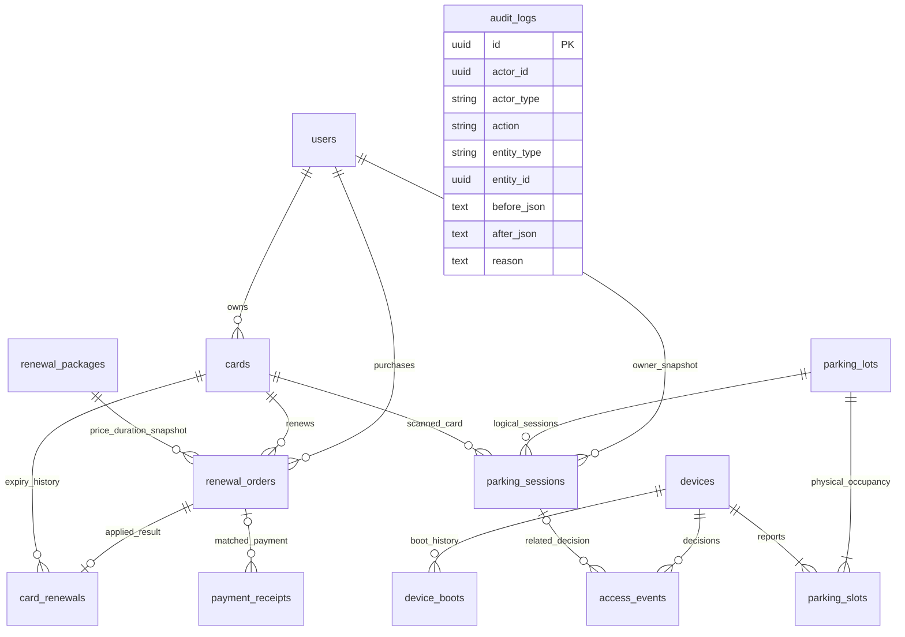

# Data model — SRS 2.3

No slot_id on sessions. Effective slot state, device online and card expired are derived from timestamps. Partial unique indexes enforce one enabled card per owner, one OPEN session per owner/card, one CREATING/PENDING order per card. REVIEW deliberately is outside the live-order unique index. Renewal's composite FK ensures its card matches the order, and unique order_id limits it to one result. Cross-table PAID/renewal invariants are enforced by the transaction service and integration tests.
